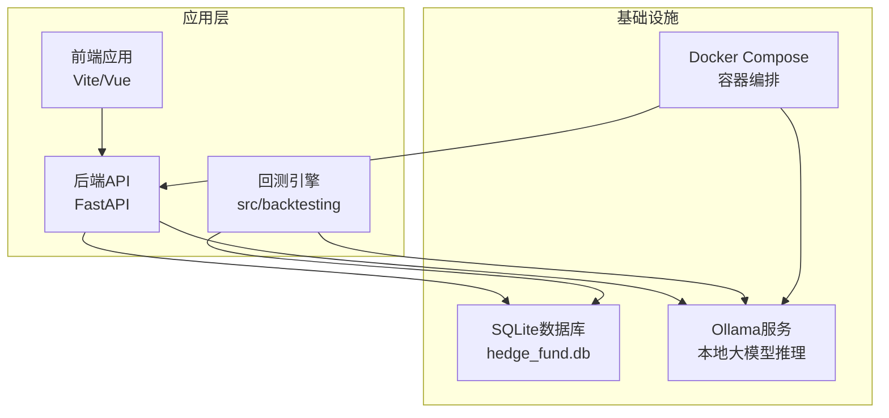
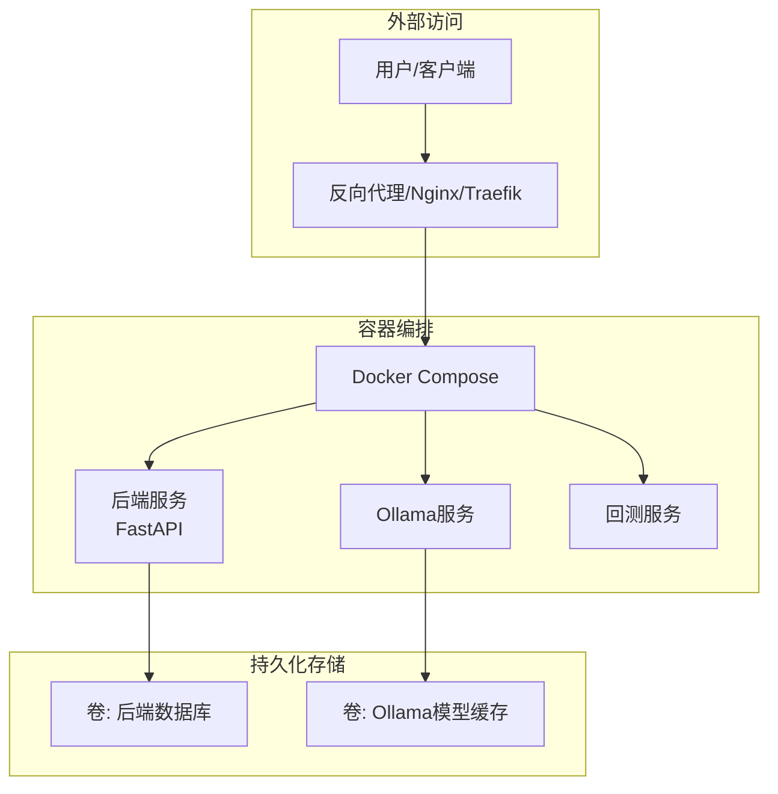
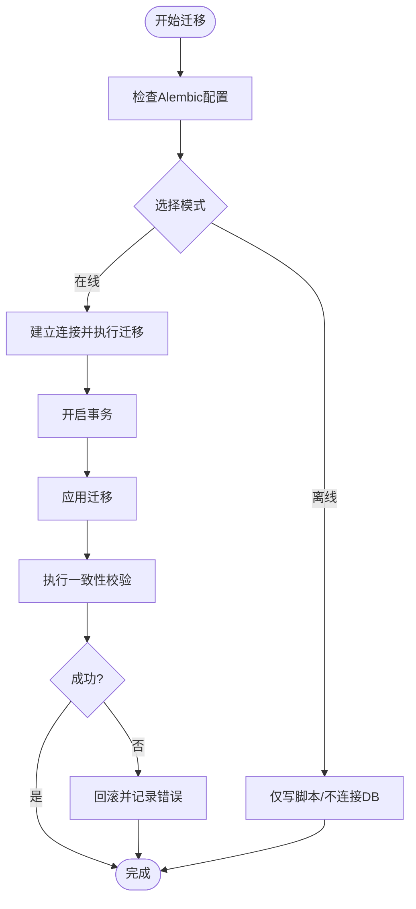
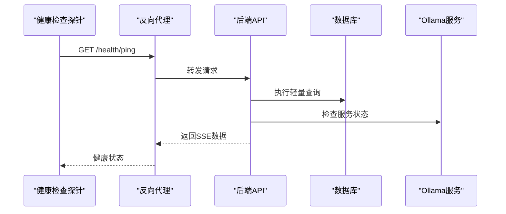
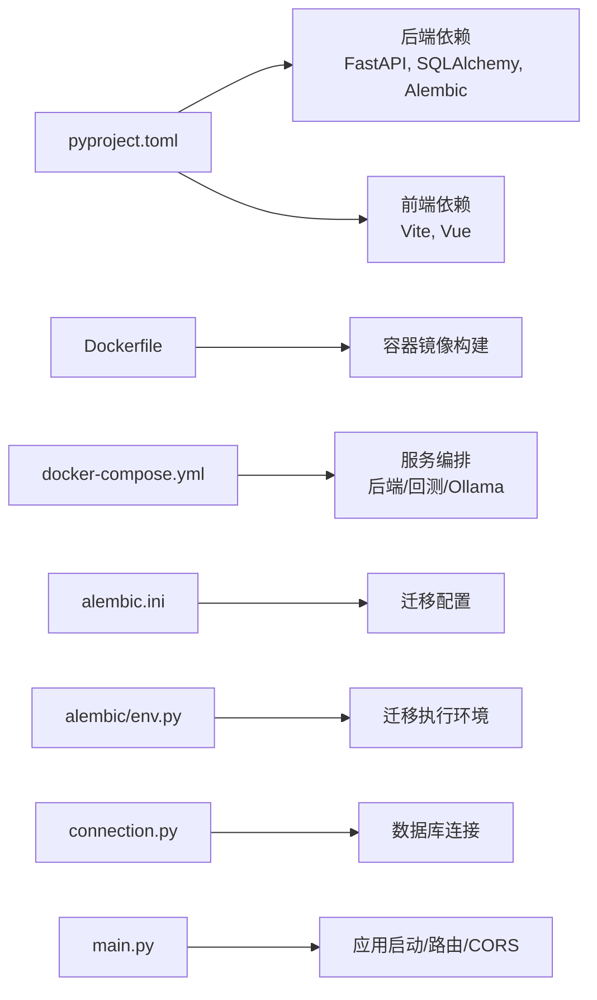

# 生产环境配置

<cite>
**本文档引用的文件**
- [app/backend/main.py](file://app/backend/main.py)
- [app/backend/alembic.ini](file://app/backend/alembic.ini)
- [app/backend/database/connection.py](file://app/backend/database/connection.py)
- [docker/docker-compose.yml](file://docker/docker-compose.yml)
- [docker/Dockerfile](file://docker/Dockerfile)
- [app/backend/alembic/env.py](file://app/backend/alembic/env.py)
- [pyproject.toml](file://pyproject.toml)
- [app/backend/routes/health.py](file://app/backend/routes/health.py)
- [app/backend/services/ollama_service.py](file://app/backend/services/ollama_service.py)
- [src/utils/docker.py](file://src/utils/docker.py)
</cite>

## 目录
1. [简介](#简介)
2. [项目结构](#项目结构)
3. [核心组件](#核心组件)
4. [架构总览](#架构总览)
5. [详细组件分析](#详细组件分析)
6. [依赖关系分析](#依赖关系分析)
7. [性能考虑](#性能考虑)
8. [故障排查指南](#故障排查指南)
9. [结论](#结论)
10. [附录](#附录)

## 简介
本指南面向运维团队，提供该AI对冲基金项目的生产环境配置与最佳实践，覆盖以下主题：
- 环境变量配置与管理（数据库连接、API密钥、日志级别、调试开关）
- 数据库迁移策略（版本管理、回滚机制、数据一致性）
- 进程管理、自动重启与故障恢复
- 静态文件服务、代理配置与SSL证书管理
- 性能调优参数、内存限制与并发配置
- 备份策略、数据归档与灾难恢复
- 标准化配置模板与实施建议

## 项目结构
后端采用FastAPI框架，数据库使用SQLite并通过SQLAlchemy建模；迁移工具使用Alembic；容器化通过Docker Compose编排，包含本地大模型推理服务Ollama。

图表来源
- [docker/docker-compose.yml:1-95](file://docker/docker-compose.yml#L1-L95)
- [app/backend/main.py:1-56](file://app/backend/main.py#L1-L56)
- [app/backend/database/connection.py:1-32](file://app/backend/database/connection.py#L1-L32)

章节来源
- [docker/docker-compose.yml:1-95](file://docker/docker-compose.yml#L1-L95)
- [docker/Dockerfile:1-23](file://docker/Dockerfile#L1-L23)
- [app/backend/main.py:1-56](file://app/backend/main.py#L1-L56)
- [app/backend/database/connection.py:1-32](file://app/backend/database/connection.py#L1-L32)

## 核心组件
- 应用入口与启动事件：初始化数据库表、CORS配置、路由注册、启动时检查Ollama可用性。
- 数据库连接：基于SQLite，使用绝对路径确保可移植性。
- 迁移系统：Alembic配置与环境脚本，支持离线/在线迁移。
- 容器化：Dockerfile与Compose定义服务、环境变量与卷挂载。
- 健康检查：SSE流式健康探测接口。
- Ollama集成：统一的服务封装，支持状态检查、模型下载/删除、进度流等。

章节来源
- [app/backend/main.py:1-56](file://app/backend/main.py#L1-L56)
- [app/backend/database/connection.py:1-32](file://app/backend/database/connection.py#L1-L32)
- [app/backend/alembic.ini:1-120](file://app/backend/alembic.ini#L1-L120)
- [app/backend/alembic/env.py:1-78](file://app/backend/alembic/env.py#L1-L78)
- [docker/docker-compose.yml:1-95](file://docker/docker-compose.yml#L1-L95)
- [docker/Dockerfile:1-23](file://docker/Dockerfile#L1-L23)
- [app/backend/routes/health.py:1-28](file://app/backend/routes/health.py#L1-L28)
- [app/backend/services/ollama_service.py:1-519](file://app/backend/services/ollama_service.py#L1-L519)

## 架构总览
生产部署建议采用“容器化 + 反向代理 + 数据持久化”的模式，后端服务通过Nginx或Traefik暴露，数据库与Ollama模型目录进行持久化卷挂载，环境变量通过外部配置文件注入。

图表来源
- [docker/docker-compose.yml:1-95](file://docker/docker-compose.yml#L1-L95)
- [docker/Dockerfile:1-23](file://docker/Dockerfile#L1-L23)

## 详细组件分析

### 环境变量与配置管理
- 数据库连接
  - 当前实现使用SQLite并以绝对路径指向本地文件，适合开发/单机场景。
  - 生产建议：改用PostgreSQL/MySQL，结合连接池与只读副本；通过环境变量注入数据库URL。
- API密钥与第三方服务
  - 项目中存在多语言模型提供商依赖，需在运行环境中注入对应API密钥。
  - 建议通过独立的密钥管理服务或容器编排平台的安全注入机制提供。
- 日志级别与调试
  - 后端默认INFO级别日志；可通过环境变量调整Python日志级别。
  - 建议生产环境统一输出到标准输出/文件，并配合集中式日志收集。
- 调试开关
  - 启动事件会检查Ollama状态；生产中应确保相关服务可用或降级处理。

章节来源
- [app/backend/database/connection.py:1-32](file://app/backend/database/connection.py#L1-L32)
- [app/backend/main.py:1-56](file://app/backend/main.py#L1-L56)
- [docker/docker-compose.yml:26-28](file://docker/docker-compose.yml#L26-L28)

### 数据库迁移策略
- 版本管理
  - 使用Alembic管理迁移脚本，版本目录位于后端目录下。
  - 建议每次变更均生成显式迁移脚本，避免autogenerate带来的不一致风险。
- 回滚机制
  - Alembic支持降级到指定版本；生产回滚需先备份数据库再执行。
- 数据一致性保证
  - 在迁移前后执行一致性校验；对关键业务表增加唯一约束与外键检查。
  - 对于生产数据库，优先使用事务包裹关键DDL操作。

图表来源
- [app/backend/alembic/env.py:28-77](file://app/backend/alembic/env.py#L28-L77)
- [app/backend/alembic.ini:1-120](file://app/backend/alembic.ini#L1-L120)

章节来源
- [app/backend/alembic.ini:1-120](file://app/backend/alembic.ini#L1-L120)
- [app/backend/alembic/env.py:1-78](file://app/backend/alembic/env.py#L1-L78)

### 进程管理、自动重启与故障恢复
- 进程管理
  - Docker Compose设置重启策略为unless-stopped，确保服务异常退出后自动恢复。
- 故障恢复
  - 健康检查接口用于探测后端可用性；建议配合反向代理的健康检查探针。
  - Ollama服务独立容器，便于隔离与快速恢复。

图表来源
- [app/backend/routes/health.py:14-27](file://app/backend/routes/health.py#L14-L27)
- [docker/docker-compose.yml:1-95](file://docker/docker-compose.yml#L1-L95)

章节来源
- [docker/docker-compose.yml:1-95](file://docker/docker-compose.yml#L1-L95)
- [app/backend/routes/health.py:1-28](file://app/backend/routes/health.py#L1-L28)

### 静态文件服务、代理配置与SSL证书管理
- 静态文件服务
  - 前端构建产物可由反向代理直接提供；后端FastAPI未内置静态文件路由。
- 代理配置
  - 建议使用Nginx/Traefik作为入口，启用Gzip压缩、HTTP/2、限流与WAF。
- SSL证书管理
  - 使用Let’s Encrypt自动化证书签发与续期；反向代理统一终止TLS。

章节来源
- [docker/docker-compose.yml:1-95](file://docker/docker-compose.yml#L1-L95)

### 性能调优参数、内存限制与并发配置
- 并发与工作进程
  - 建议在反向代理后使用ASGI服务器（如uvicorn）并配置合适的worker数量与并发连接数。
- 内存限制
  - 通过Docker资源限制控制容器内存上限，防止内存泄漏导致系统不稳定。
- 数据库连接池
  - 将SQLite替换为生产数据库后，合理设置最大连接数与超时时间。
- 大模型推理优化
  - 根据硬件能力启用GPU加速（如Apple Metal），并限制并发下载与推理任务。

章节来源
- [docker/docker-compose.yml:7-16](file://docker/docker-compose.yml#L7-L16)
- [app/backend/services/ollama_service.py:1-519](file://app/backend/services/ollama_service.py#L1-L519)

### 备份策略、数据归档与灾难恢复
- 备份策略
  - 数据库：定时快照（每日全量+每小时增量），加密传输至对象存储。
  - 模型缓存：定期打包镜像或导出模型清单，便于快速重建。
- 数据归档
  - 历史交易与回测结果按时间归档，保留最少90天以上。
- 灾难恢复
  - 制定RTO/RPO目标；演练跨区域恢复流程；确保Ollama模型与后端镜像可快速拉起。

## 依赖关系分析

图表来源
- [pyproject.toml:1-62](file://pyproject.toml#L1-L62)
- [docker/Dockerfile:1-23](file://docker/Dockerfile#L1-L23)
- [docker/docker-compose.yml:1-95](file://docker/docker-compose.yml#L1-L95)
- [app/backend/alembic.ini:1-120](file://app/backend/alembic.ini#L1-L120)
- [app/backend/alembic/env.py:1-78](file://app/backend/alembic/env.py#L1-L78)
- [app/backend/database/connection.py:1-32](file://app/backend/database/connection.py#L1-L32)
- [app/backend/main.py:1-56](file://app/backend/main.py#L1-L56)

章节来源
- [pyproject.toml:1-62](file://pyproject.toml#L1-L62)
- [docker/docker-compose.yml:1-95](file://docker/docker-compose.yml#L1-L95)

## 性能考虑
- 数据库
  - SQLite适合小规模场景；生产建议迁移到PostgreSQL/MySQL，启用连接池与只读副本。
- 推理服务
  - 合理设置Ollama并发与模型缓存，避免频繁下载造成延迟。
- 反向代理
  - 开启Gzip/HTTP/2，限制上传大小与并发连接数，配置合理的超时与重试策略。

## 故障排查指南
- Ollama不可用
  - 检查容器是否运行、端口映射是否正确、网络连通性。
  - 使用健康检查接口确认后端能够访问Ollama。
- 数据库连接失败
  - 确认数据库文件权限与路径；若更换为远程数据库，检查网络与认证信息。
- 迁移失败
  - 查看迁移日志，必要时回退到上一版本并修复问题后再升级。

章节来源
- [app/backend/services/ollama_service.py:1-519](file://app/backend/services/ollama_service.py#L1-L519)
- [app/backend/routes/health.py:1-28](file://app/backend/routes/health.py#L1-L28)
- [docker/docker-compose.yml:1-95](file://docker/docker-compose.yml#L1-L95)

## 结论
本指南提供了从环境变量、数据库迁移、容器编排到性能与灾备的生产级配置要点。建议在正式上线前完成安全加固、监控告警与演练测试，确保系统稳定可靠。

## 附录

### 环境变量清单（建议）
- 数据库
  - 数据库URL（推荐使用PostgreSQL/MySQL）
- 大模型服务
  - Ollama基础地址
  - 各语言模型提供商API密钥
- 日志与调试
  - 日志级别
  - 调试开关

章节来源
- [docker/docker-compose.yml:26-28](file://docker/docker-compose.yml#L26-L28)
- [app/backend/database/connection.py:1-32](file://app/backend/database/connection.py#L1-L32)

### 迁移执行步骤（建议）
- 生成迁移脚本
- 在预生产验证
- 执行迁移并验证
- 记录回滚点

章节来源
- [app/backend/alembic/env.py:28-77](file://app/backend/alembic/env.py#L28-L77)
- [app/backend/alembic.ini:1-120](file://app/backend/alembic.ini#L1-L120)

### 容器编排要点
- 设置重启策略
- 明确卷挂载（数据库、模型缓存）
- 注入环境变量与密钥

章节来源
- [docker/docker-compose.yml:1-95](file://docker/docker-compose.yml#L1-L95)
- [docker/Dockerfile:1-23](file://docker/Dockerfile#L1-L23)