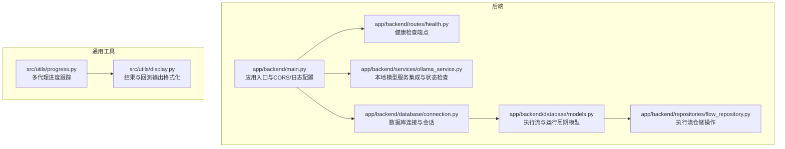
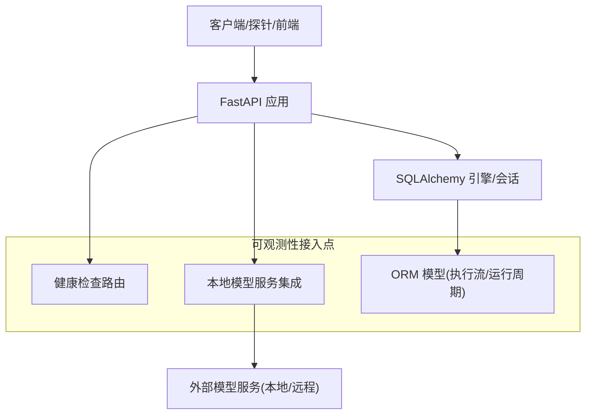
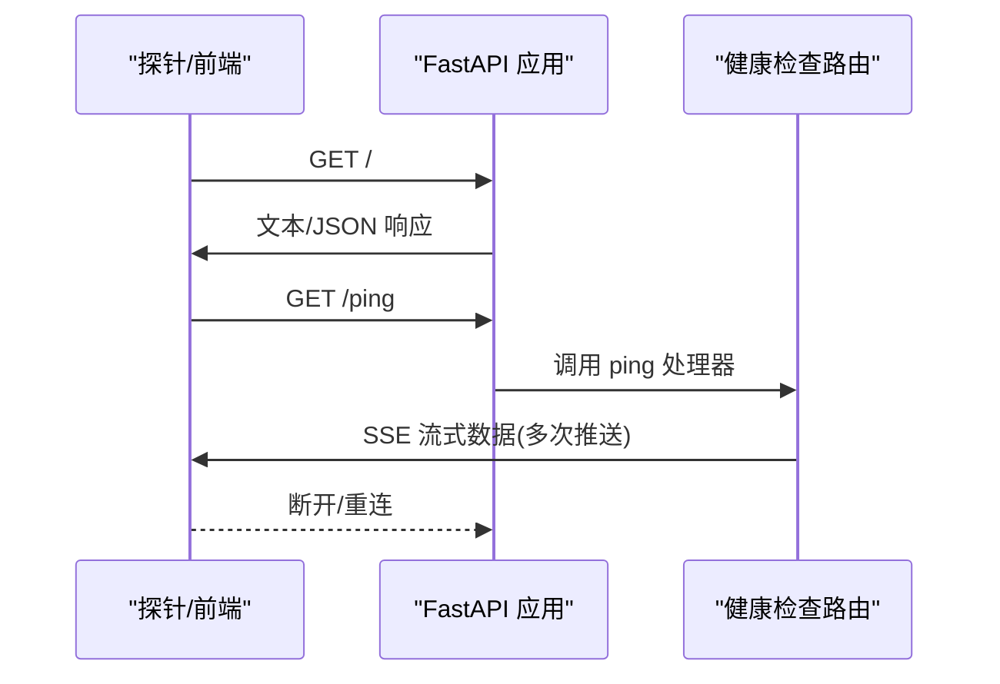
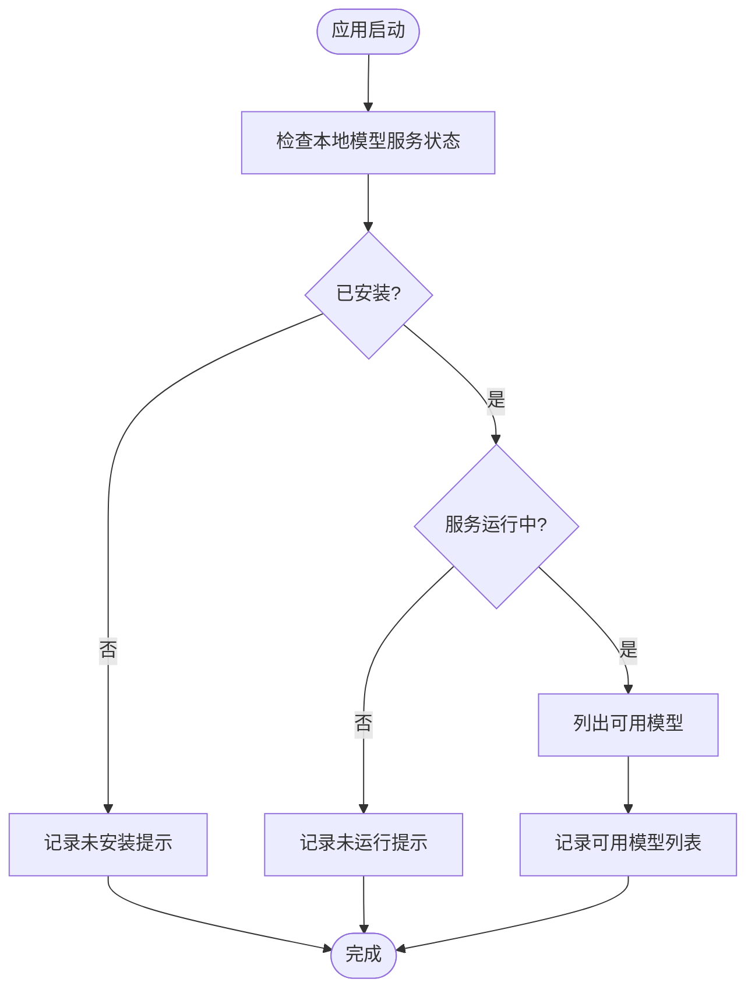
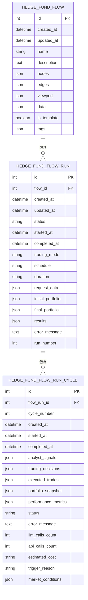
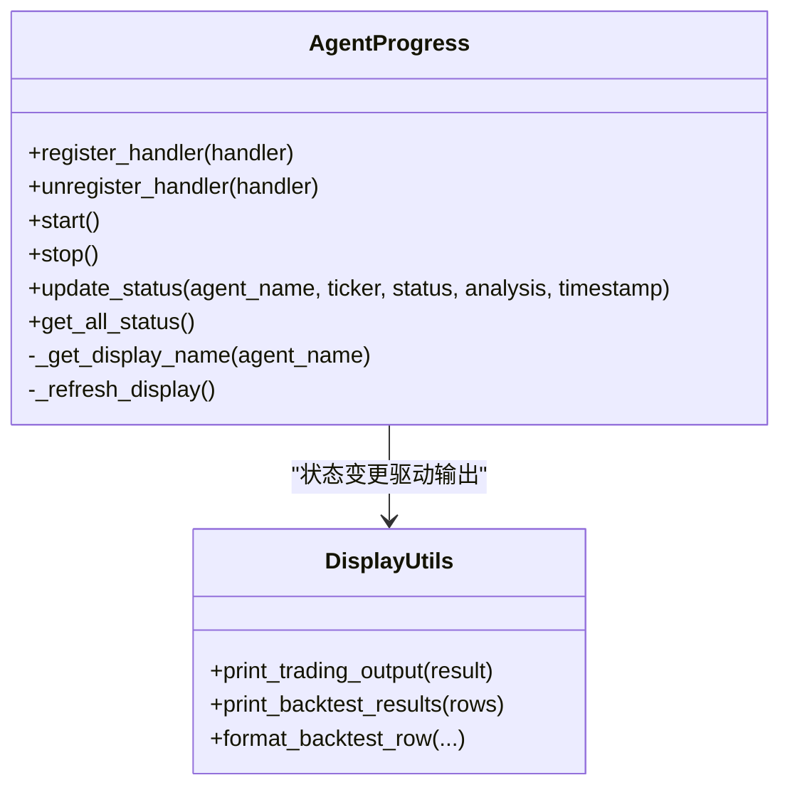
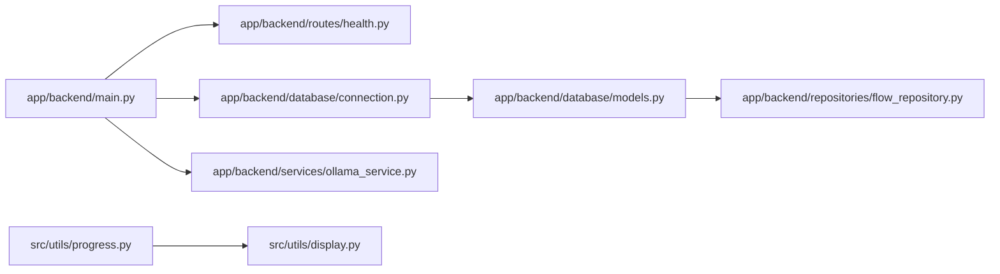

# 监控告警

<cite>
**本文引用的文件**
- [README.md](file://README.md)
- [app/backend/main.py](file://app/backend/main.py)
- [app/backend/routes/health.py](file://app/backend/routes/health.py)
- [app/backend/services/ollama_service.py](file://app/backend/services/ollama_service.py)
- [app/backend/database/connection.py](file://app/backend/database/connection.py)
- [app/backend/database/models.py](file://app/backend/database/models.py)
- [app/backend/repositories/flow_repository.py](file://app/backend/repositories/flow_repository.py)
- [src/utils/progress.py](file://src/utils/progress.py)
- [src/utils/display.py](file://src/utils/display.py)
</cite>

## 目录
1. [简介](#简介)
2. [项目结构](#项目结构)
3. [核心组件](#核心组件)
4. [架构总览](#架构总览)
5. [组件详解](#组件详解)
6. [依赖关系分析](#依赖关系分析)
7. [性能考量](#性能考量)
8. [故障排查指南](#故障排查指南)
9. [结论](#结论)
10. [附录](#附录)

## 简介
本指南面向运维与开发团队，围绕系统健康检查、监控指标采集、日志聚合与可视化、告警规则与通知渠道、APM工具集成（Prometheus/Grafana/ELK）、异常检测与趋势分析、容量规划以及监控仪表板与告警响应流程的最佳实践展开。当前代码库已具备基础健康检查端点与启动期健康探测能力，并在数据库与运行时状态管理方面提供了可观测性基础。本文将基于现有实现扩展到完整的监控告警体系。

## 项目结构
后端采用 FastAPI 框架，路由模块提供健康检查端点；服务层封装外部依赖（如本地大模型服务）；数据库层使用 SQLAlchemy 管理执行流与运行周期等业务数据；CLI/前端侧提供进度与输出展示能力。下图给出与监控相关的关键文件与职责映射：

**图表来源**
- [app/backend/main.py:1-56](file://app/backend/main.py#L1-L56)
- [app/backend/routes/health.py:1-28](file://app/backend/routes/health.py#L1-L28)
- [app/backend/services/ollama_service.py:1-519](file://app/backend/services/ollama_service.py#L1-L519)
- [app/backend/database/connection.py:1-32](file://app/backend/database/connection.py#L1-L32)
- [app/backend/database/models.py:1-115](file://app/backend/database/models.py#L1-L115)
- [app/backend/repositories/flow_repository.py:1-103](file://app/backend/repositories/flow_repository.py#L1-L103)
- [src/utils/progress.py:1-117](file://src/utils/progress.py#L1-L117)
- [src/utils/display.py:1-396](file://src/utils/display.py#L1-L396)

**章节来源**
- [README.md:1-158](file://README.md#L1-L158)
- [app/backend/main.py:1-56](file://app/backend/main.py#L1-L56)
- [app/backend/routes/health.py:1-28](file://app/backend/routes/health.py#L1-L28)
- [app/backend/services/ollama_service.py:1-519](file://app/backend/services/ollama_service.py#L1-L519)
- [app/backend/database/connection.py:1-32](file://app/backend/database/connection.py#L1-L32)
- [app/backend/database/models.py:1-115](file://app/backend/database/models.py#L1-L115)
- [app/backend/repositories/flow_repository.py:1-103](file://app/backend/repositories/flow_repository.py#L1-L103)
- [src/utils/progress.py:1-117](file://src/utils/progress.py#L1-L117)
- [src/utils/display.py:1-396](file://src/utils/display.py#L1-L396)

## 核心组件
- 健康检查端点：提供根路径与事件流式 ping 探针，便于外部探针与前端实时心跳验证。
- 启动期健康探测：在应用启动事件中检查本地模型服务可用性，记录安装、运行与模型列表状态。
- 数据持久化：通过 ORM 模型记录执行流、运行周期、成本与性能指标，为指标采集与趋势分析提供数据源。
- 进度与输出：提供多代理状态跟踪与结果表格化输出，辅助可观测性与问题定位。

**章节来源**
- [app/backend/routes/health.py:9-28](file://app/backend/routes/health.py#L9-L28)
- [app/backend/main.py:32-56](file://app/backend/main.py#L32-L56)
- [app/backend/database/models.py:29-95](file://app/backend/database/models.py#L29-L95)
- [src/utils/progress.py:12-117](file://src/utils/progress.py#L12-L117)
- [src/utils/display.py:17-255](file://src/utils/display.py#L17-L255)

## 架构总览
下图展示从客户端到后端服务、数据库与外部依赖的交互路径，以及与监控相关的观测点位置：

**图表来源**
- [app/backend/main.py:15-31](file://app/backend/main.py#L15-L31)
- [app/backend/routes/health.py:9-28](file://app/backend/routes/health.py#L9-L28)
- [app/backend/services/ollama_service.py:34-56](file://app/backend/services/ollama_service.py#L34-L56)
- [app/backend/database/connection.py:14-32](file://app/backend/database/connection.py#L14-L32)
- [app/backend/database/models.py:6-95](file://app/backend/database/models.py#L6-L95)

## 组件详解

### 健康检查端点
- 路由设计：根路径返回欢迎信息；/ping 使用服务器推送事件（SSE）持续发送心跳包，便于前端或探针实时感知服务状态。
- 适用场景：容器编排健康探针、前端实时心跳、外部监控系统拉取状态。
- 扩展建议：增加更细粒度的子系统检查（数据库连通性、外部服务可用性），并以统一的健康状态码返回。

**图表来源**
- [app/backend/routes/health.py:9-28](file://app/backend/routes/health.py#L9-L28)

**章节来源**
- [app/backend/routes/health.py:9-28](file://app/backend/routes/health.py#L9-L28)

### 启动期健康探测与日志
- 启动事件：应用启动时检查本地模型服务安装与运行状态，记录可用模型列表与服务器地址。
- 日志策略：使用标准日志模块输出 INFO/WARNING 级别信息，便于集中化收集与检索。
- 建议：将日志结构化为 JSON，包含服务名、版本、实例标识、时间戳、级别、消息体与上下文字段，便于 ELK/Promtail 等工具解析。

**图表来源**
- [app/backend/main.py:32-56](file://app/backend/main.py#L32-L56)
- [app/backend/services/ollama_service.py:34-56](file://app/backend/services/ollama_service.py#L34-L56)

**章节来源**
- [app/backend/main.py:32-56](file://app/backend/main.py#L32-L56)
- [app/backend/services/ollama_service.py:34-56](file://app/backend/services/ollama_service.py#L34-L56)

### 数据模型与指标采集
- 执行流与运行周期：模型记录每次运行的状态、开始/结束时间、交易决策、组合快照、性能指标与成本统计，天然适合作为 KPI 的数据源。
- 成本与调用计数：支持 LLM 调用次数、外部 API 调用次数与估算成本，可用于成本 KPI 与容量规划。
- 建议：为每个运行周期补充延迟、错误计数、队列等待时间等指标，结合数据库查询与外部服务调用埋点进行采集。

**图表来源**
- [app/backend/database/models.py:6-95](file://app/backend/database/models.py#L6-L95)

**章节来源**
- [app/backend/database/models.py:29-95](file://app/backend/database/models.py#L29-L95)

### 进度跟踪与输出展示
- 多代理进度：统一记录各代理状态、标的、分析阶段与时间戳，便于可视化与告警联动。
- 输出格式化：提供表格化输出与颜色编码，辅助快速定位问题与生成报告。

**图表来源**
- [src/utils/progress.py:12-117](file://src/utils/progress.py#L12-L117)
- [src/utils/display.py:17-255](file://src/utils/display.py#L17-L255)

**章节来源**
- [src/utils/progress.py:12-117](file://src/utils/progress.py#L12-L117)
- [src/utils/display.py:17-255](file://src/utils/display.py#L17-L255)

## 依赖关系分析
- 应用入口依赖路由、数据库连接与服务层；路由依赖异步事件流；服务层依赖外部模型服务客户端；数据库层依赖 SQLAlchemy；工具层提供进度与显示能力。
- 建议：为关键路径增加中间件埋点（请求耗时、状态码、异常），并与数据库写入形成闭环，确保可观测性覆盖全链路。

**图表来源**
- [app/backend/main.py:15-31](file://app/backend/main.py#L15-L31)
- [app/backend/routes/health.py:1-28](file://app/backend/routes/health.py#L1-L28)
- [app/backend/database/connection.py:14-32](file://app/backend/database/connection.py#L14-L32)
- [app/backend/services/ollama_service.py:19-56](file://app/backend/services/ollama_service.py#L19-L56)
- [app/backend/database/models.py:6-95](file://app/backend/database/models.py#L6-L95)
- [app/backend/repositories/flow_repository.py:6-28](file://app/backend/repositories/flow_repository.py#L6-L28)
- [src/utils/progress.py:12-117](file://src/utils/progress.py#L12-L117)
- [src/utils/display.py:17-255](file://src/utils/display.py#L17-L255)

**章节来源**
- [app/backend/main.py:15-31](file://app/backend/main.py#L15-L31)
- [app/backend/routes/health.py:1-28](file://app/backend/routes/health.py#L1-L28)
- [app/backend/database/connection.py:14-32](file://app/backend/database/connection.py#L14-L32)
- [app/backend/services/ollama_service.py:19-56](file://app/backend/services/ollama_service.py#L19-L56)
- [app/backend/database/models.py:6-95](file://app/backend/database/models.py#L6-L95)
- [app/backend/repositories/flow_repository.py:6-28](file://app/backend/repositories/flow_repository.py#L6-L28)
- [src/utils/progress.py:12-117](file://src/utils/progress.py#L12-L117)
- [src/utils/display.py:17-255](file://src/utils/display.py#L17-L255)

## 性能考量
- 健康检查端点：SSE 流式推送适合前端实时心跳，但需注意并发连接数与带宽占用；建议限制推送次数与频率。
- 启动期探测：对本地服务进行轻量级探测，避免阻塞启动；可将探测结果缓存并在后续周期复用。
- 数据库写入：运行周期指标写入频繁，建议批量提交、索引优化与分表策略；对高并发场景启用连接池参数调优。
- 外部服务：本地模型服务的下载/删除/拉取过程可能阻塞，建议异步处理与进度上报，避免影响主流程。

[本节为通用指导，无需具体文件来源]

## 故障排查指南
- 健康检查不可达：确认路由是否正确挂载、CORS 配置是否允许访问来源、SSE 是否被代理/网关正确转发。
- 启动期本地模型服务异常：检查服务是否已安装、进程是否在运行、端口是否被占用；查看日志中的错误信息与可用模型列表。
- 数据库连接失败：核对数据库路径与权限、SQLite 文件是否存在、连接参数是否正确。
- 运行周期指标缺失：确认写入逻辑是否触发、字段是否完整、异常分支是否捕获并记录。

**章节来源**
- [app/backend/main.py:32-56](file://app/backend/main.py#L32-L56)
- [app/backend/routes/health.py:9-28](file://app/backend/routes/health.py#L9-L28)
- [app/backend/database/connection.py:14-32](file://app/backend/database/connection.py#L14-L32)
- [app/backend/database/models.py:59-95](file://app/backend/database/models.py#L59-L95)

## 结论
当前代码库已具备健康检查与启动期健康探测的基础能力，并通过数据库模型沉淀了丰富的运行时指标，为构建完善的监控告警体系提供了坚实的数据基础。建议在此基础上引入统一指标采集、日志结构化、告警规则与通知通道、APM 工具集成以及异常检测与容量规划机制，形成闭环的可观测性体系。

[本节为总结性内容，无需具体文件来源]

## 附录

### 关键性能指标（KPI）定义与采集建议
- 响应时间：接口耗时（P50/P95/P99）、SSE 心跳往返时间；可通过中间件埋点与数据库写入耗时统计。
- 吞吐量：每秒请求数（QPS）、每周期处理任务数、模型下载/删除速率。
- 错误率：HTTP 5xx 比例、运行周期错误比例、外部服务调用失败率。
- 资源利用率：CPU/内存/磁盘 IO、数据库连接池使用率、模型服务进程资源占用。
- 成本与调用：LLM 调用次数与估算成本、外部 API 调用次数与费用。

**章节来源**
- [app/backend/database/models.py:87-95](file://app/backend/database/models.py#L87-L95)

### 日志聚合、分析与可视化
- 结构化日志：将 INFO/WARNING/ERROR 级别日志转为 JSON，包含服务名、版本、实例、时间戳、模块、消息体与上下文字段。
- 收集：使用集中化日志采集器（如 Promtail/Filebeat）收集容器/主机日志。
- 存储与检索：ELK/EFK 或云日志平台存储与查询。
- 可视化：Kibana/Grafana 展示日志仪表板，关联指标与告警。

[本节为概念性内容，无需具体文件来源]

### 告警规则与通知
- 阈值配置：健康检查失败次数、响应时间超限、错误率突增、资源使用率超阈、成本预算超支。
- 告警级别：轻微（降级）、严重（影响面小）、危急（影响面大）。
- 通知渠道：邮件、即时通讯、电话（按级别分级）。
- 自动处置：结合探针与编排系统自动重启/扩缩容。

[本节为概念性内容，无需具体文件来源]

### APM 工具集成方案
- Prometheus：暴露指标端点，采集 CPU/内存/请求耗时/错误率/指标计数。
- Grafana：构建仪表板，关联日志与指标，设置告警面板。
- ELK Stack：日志采集、分析与可视化，结合指标做根因分析。

[本节为概念性内容，无需具体文件来源]

### 异常检测、趋势分析与容量规划
- 异常检测：基于历史基线与统计模型识别异常波动。
- 趋势分析：按天/周/月聚合指标，识别增长与下降趋势。
- 容量规划：结合成本与吞吐量趋势，评估资源扩容与降配时机。

[本节为概念性内容，无需具体文件来源]

### 运维最佳实践
- 仪表板设计：统一命名规范、清晰的层级与颜色编码；区分实时与历史视图。
- 告警响应流程：标准化 SLO/SLI、分级响应、工单与升级机制、复盘与改进。

[本节为概念性内容，无需具体文件来源]