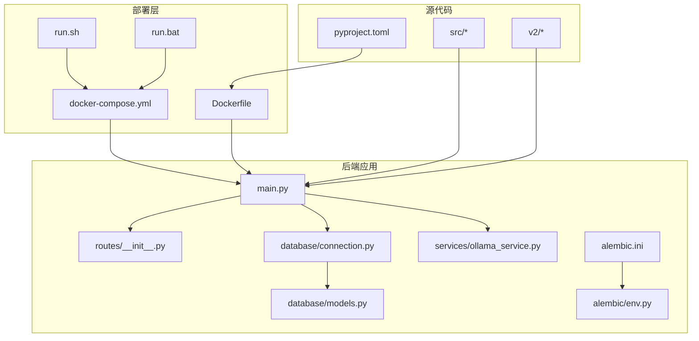
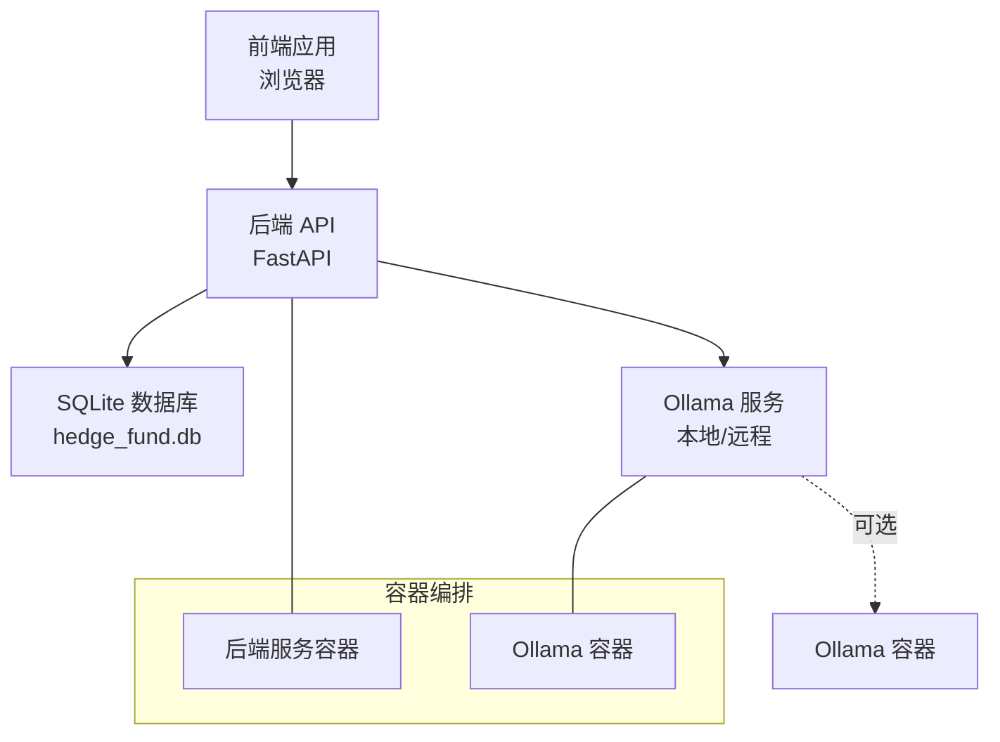
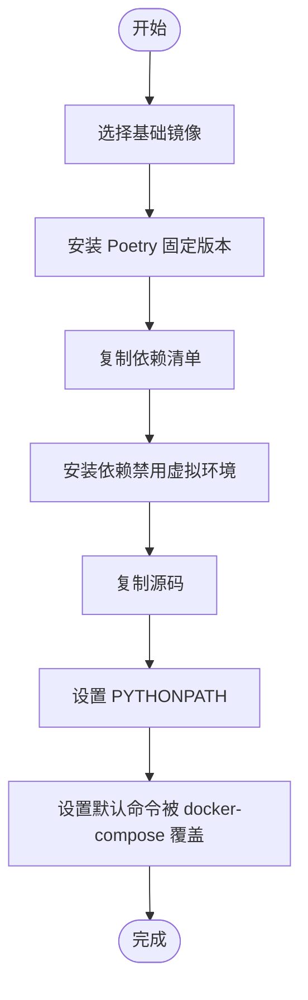
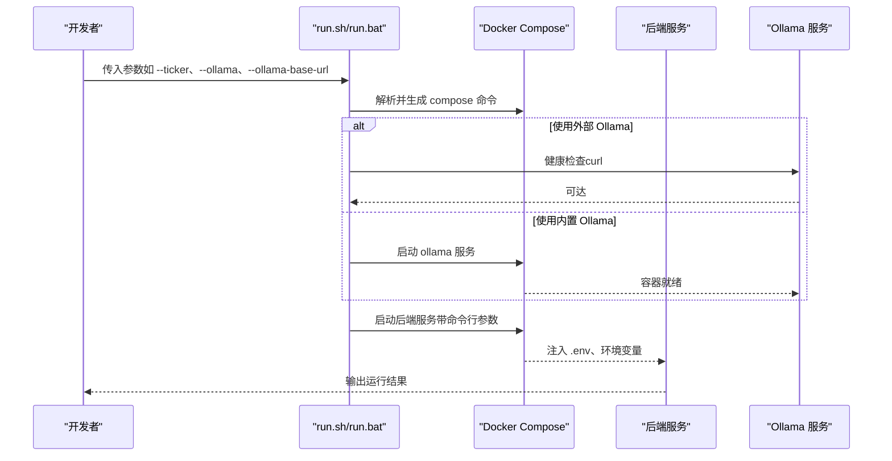
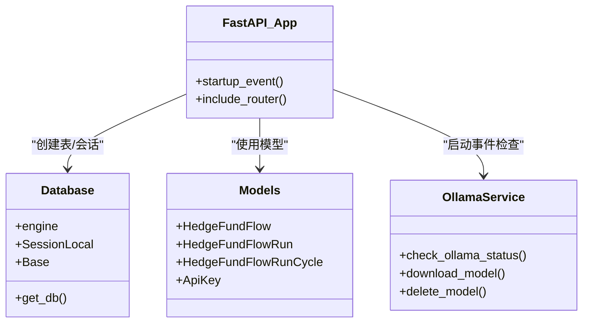
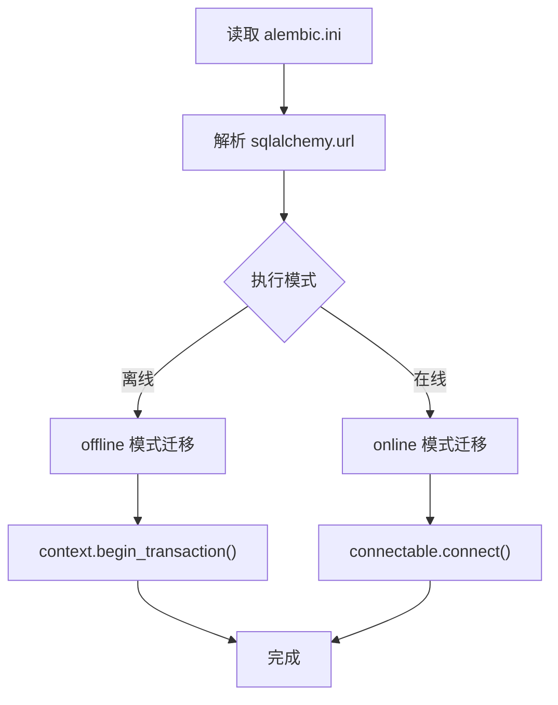
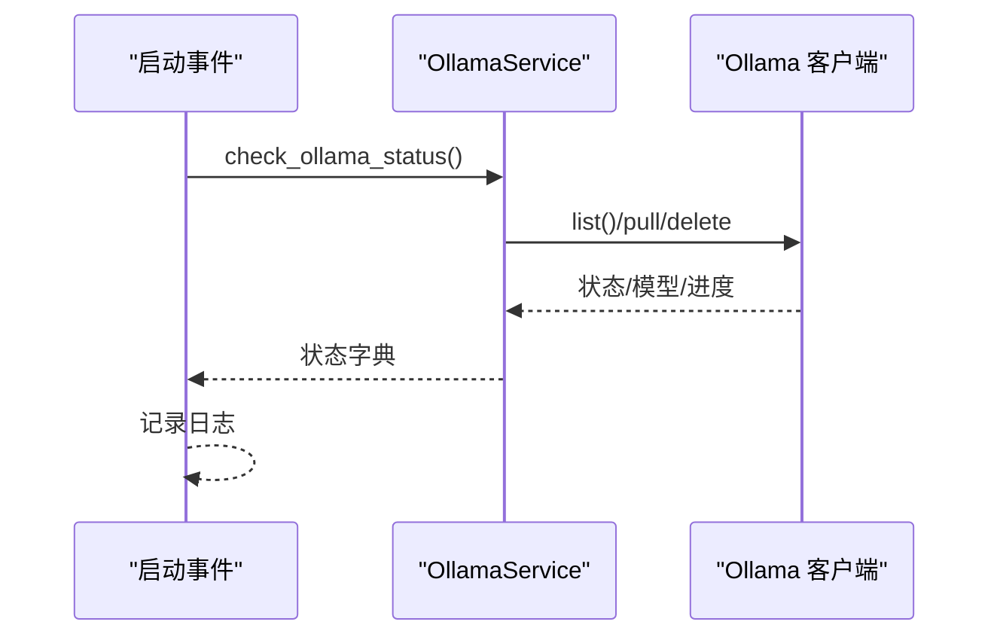
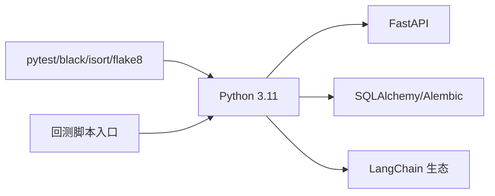

# 部署运维

<cite>
**本文引用的文件**
- [Dockerfile](file://docker/Dockerfile)
- [docker-compose.yml](file://docker/docker-compose.yml)
- [run.sh](file://docker/run.sh)
- [run.bat](file://docker/run.bat)
- [pyproject.toml](file://pyproject.toml)
- [alembic.ini](file://app/backend/alembic.ini)
- [env.py](file://app/backend/alembic/env.py)
- [connection.py](file://app/backend/database/connection.py)
- [models.py](file://app/backend/database/models.py)
- [main.py](file://app/backend/main.py)
- [ollama_service.py](file://app/backend/services/ollama_service.py)
- [routes/__init__.py](file://app/backend/routes/__init__.py)
</cite>

## 目录
1. [简介](#简介)
2. [项目结构](#项目结构)
3. [核心组件](#核心组件)
4. [架构总览](#架构总览)
5. [详细组件分析](#详细组件分析)
6. [依赖分析](#依赖分析)
7. [性能考虑](#性能考虑)
8. [故障排查指南](#故障排查指南)
9. [结论](#结论)
10. [附录](#附录)

## 简介
本指南面向运维工程师与平台工程团队，提供从开发环境到生产环境的完整部署与运维实践。内容覆盖：
- Docker 容器化与镜像构建策略
- 容器编排与服务组合（含本地/外部 Ollama）
- 生产环境部署流程、环境变量与依赖管理
- 数据库迁移、数据备份与恢复策略
- 监控告警、日志管理与性能优化
- 负载均衡、高可用与灾难恢复方案
- 安全加固、权限管理与合规建议
- 从开发到生产的端到端运维路径

## 项目结构
该仓库采用多模块组织：后端 FastAPI 应用、前端 Vite/React 前端、Python 源码与脚本、以及 Docker 化部署工具链。部署相关的关键目录与文件如下：
- docker/：Dockerfile、docker-compose.yml、运行脚本 run.sh/run.bat
- app/backend/：FastAPI 后端、数据库连接与模型、Alembic 迁移配置
- pyproject.toml：Poetry 依赖与脚本入口
- src/ 与 v2/：核心业务逻辑与回测引擎

**图表来源**
- [Dockerfile:1-23](file://docker/Dockerfile#L1-L23)
- [docker-compose.yml:1-95](file://docker/docker-compose.yml#L1-L95)
- [run.sh:1-372](file://docker/run.sh#L1-L372)
- [run.bat:1-414](file://docker/run.bat#L1-L414)
- [main.py:1-56](file://app/backend/main.py#L1-L56)
- [routes/__init__.py:1-24](file://app/backend/routes/__init__.py#L1-L24)
- [connection.py:1-32](file://app/backend/database/connection.py#L1-L32)
- [models.py:1-115](file://app/backend/database/models.py#L1-L115)
- [ollama_service.py:1-519](file://app/backend/services/ollama_service.py#L1-L519)
- [alembic.ini:1-120](file://app/backend/alembic.ini#L1-L120)
- [env.py:1-78](file://app/backend/alembic/env.py#L1-L78)
- [pyproject.toml:1-62](file://pyproject.toml#L1-L62)

**章节来源**
- [Dockerfile:1-23](file://docker/Dockerfile#L1-L23)
- [docker-compose.yml:1-95](file://docker/docker-compose.yml#L1-L95)
- [run.sh:1-372](file://docker/run.sh#L1-L372)
- [run.bat:1-414](file://docker/run.bat#L1-L414)
- [pyproject.toml:1-62](file://pyproject.toml#L1-L62)

## 核心组件
- 容器镜像与构建
  - 使用官方 Python slim 基础镜像，安装 Poetry 并以非虚拟环境模式安装依赖，随后复制源码，CMD 指向主程序入口。
- 容器编排与服务组合
  - 提供多个服务实例：主应用、推理模式、回测、Ollama 服务；支持嵌入式或外部 Ollama；通过 .env 卷挂载注入密钥与配置。
- 后端服务与数据库
  - FastAPI 应用在启动时初始化 SQLite 表结构；数据库连接使用绝对路径；模型定义涵盖流配置、执行记录、分析周期、API 密钥等。
- 迁移与版本控制
  - Alembic 配置指向本地 SQLite 文件，提供离线/在线迁移执行环境。
- LLM 服务集成
  - Ollama 服务封装了状态检查、模型拉取/删除、进度流等能力，并在启动事件中进行健康检查提示。

**章节来源**
- [Dockerfile:1-23](file://docker/Dockerfile#L1-L23)
- [docker-compose.yml:1-95](file://docker/docker-compose.yml#L1-L95)
- [main.py:1-56](file://app/backend/main.py#L1-L56)
- [connection.py:1-32](file://app/backend/database/connection.py#L1-L32)
- [models.py:1-115](file://app/backend/database/models.py#L1-L115)
- [alembic.ini:1-120](file://app/backend/alembic.ini#L1-L120)
- [env.py:1-78](file://app/backend/alembic/env.py#L1-L78)
- [ollama_service.py:1-519](file://app/backend/services/ollama_service.py#L1-L519)

## 架构总览
下图展示容器化部署的整体交互：前端通过浏览器访问后端 API；后端通过 Ollama 服务调用本地/远程大模型；数据库存储应用元数据与运行结果；迁移工具保障数据库演进。

**图表来源**
- [docker-compose.yml:1-95](file://docker/docker-compose.yml#L1-L95)
- [main.py:1-56](file://app/backend/main.py#L1-L56)
- [connection.py:1-32](file://app/backend/database/connection.py#L1-L32)
- [ollama_service.py:1-519](file://app/backend/services/ollama_service.py#L1-L519)

## 详细组件分析

### 容器镜像与构建策略
- 基础镜像与依赖安装
  - 使用 slim 版 Python，安装指定版本的 Poetry，仅先复制依赖清单以提升缓存命中率，再安装依赖，最后复制全部源码。
- 运行入口
  - 默认 CMD 指向主程序入口，实际运行由 docker-compose 的 command 字段覆盖。
- 环境变量与路径
  - 设置 PYTHONPATH 为应用根目录，确保模块导入正确。

**图表来源**
- [Dockerfile:1-23](file://docker/Dockerfile#L1-L23)

**章节来源**
- [Dockerfile:1-23](file://docker/Dockerfile#L1-L23)

### 容器编排与服务组合
- 多服务实例
  - 提供主应用、带推理输出的主应用、带 Ollama 的主应用、回测与带 Ollama 的回测等服务，均复用同一镜像。
- Ollama 集成
  - 支持嵌入式 Ollama（通过 profile 启动）与外部 Ollama（通过环境变量 OLLAMA_BASE_URL 指定）。
- 环境与卷
  - 通过 .env 卷挂载注入密钥；设置 PYTHONUNBUFFERED、PYTHONPATH 等运行时参数。
- GPU 加速
  - 脚本检测系统架构并在需要时合并 compose 配置文件以启用 GPU 相关配置。

**图表来源**
- [run.sh:1-372](file://docker/run.sh#L1-L372)
- [run.bat:1-414](file://docker/run.bat#L1-L414)
- [docker-compose.yml:1-95](file://docker/docker-compose.yml#L1-L95)

**章节来源**
- [docker-compose.yml:1-95](file://docker/docker-compose.yml#L1-L95)
- [run.sh:1-372](file://docker/run.sh#L1-L372)
- [run.bat:1-414](file://docker/run.bat#L1-L414)

### 后端服务与数据库
- 启动流程
  - 初始化数据库表结构；配置 CORS；注册路由；启动事件中检查 Ollama 状态并记录日志。
- 数据库连接
  - 使用绝对路径的 SQLite 文件；为 SQLite 配置跨线程连接参数。
- 数据模型
  - 流配置、执行记录、分析周期、API 密钥等模型定义清晰，便于迁移与审计。

**图表来源**
- [main.py:1-56](file://app/backend/main.py#L1-L56)
- [connection.py:1-32](file://app/backend/database/connection.py#L1-L32)
- [models.py:1-115](file://app/backend/database/models.py#L1-L115)
- [ollama_service.py:1-519](file://app/backend/services/ollama_service.py#L1-L519)

**章节来源**
- [main.py:1-56](file://app/backend/main.py#L1-L56)
- [connection.py:1-32](file://app/backend/database/connection.py#L1-L32)
- [models.py:1-115](file://app/backend/database/models.py#L1-L115)

### 数据库迁移与版本控制
- 配置要点
  - 指向本地 SQLite 文件；日志级别与格式；可扩展为多版本目录与递归扫描。
- 执行方式
  - 在线/离线两种迁移执行路径，结合 Alembic 环境配置。

**图表来源**
- [alembic.ini:1-120](file://app/backend/alembic.ini#L1-L120)
- [env.py:1-78](file://app/backend/alembic/env.py#L1-L78)

**章节来源**
- [alembic.ini:1-120](file://app/backend/alembic.ini#L1-L120)
- [env.py:1-78](file://app/backend/alembic/env.py#L1-L78)

### LLM 服务集成（Ollama）
- 能力范围
  - 安装检测、服务启停、模型下载/删除、进度流、可用模型筛选、错误处理。
- 启动事件
  - 后端在启动时检查 Ollama 安装状态、运行状态与可用模型列表，并输出日志提示。

**图表来源**
- [main.py:32-56](file://app/backend/main.py#L32-L56)
- [ollama_service.py:1-519](file://app/backend/services/ollama_service.py#L1-L519)

**章节来源**
- [main.py:32-56](file://app/backend/main.py#L32-L56)
- [ollama_service.py:1-519](file://app/backend/services/ollama_service.py#L1-L519)

## 依赖分析
- 语言与框架
  - Python 3.11；FastAPI、SQLAlchemy、Alembic；LangChain 生态（OpenAI、Anthropic、Groq、DeepSeek、Google GenAI、XAI、GigaChat 等）。
- 开发与测试
  - pytest、black、isort、flake8。
- 运行时脚本
  - 回测脚本入口定义于 pyproject.toml。

**图表来源**
- [pyproject.toml:1-62](file://pyproject.toml#L1-L62)

**章节来源**
- [pyproject.toml:1-62](file://pyproject.toml#L1-L62)

## 性能考虑
- 容器层
  - 使用 slim 基础镜像减少体积；按需安装依赖；合理分层缓存。
- 运行时
  - 设置 PYTHONUNBUFFERED=1 保证日志实时输出；根据硬件选择合适的 Ollama 模型大小与并发。
- 数据库
  - SQLite 适合开发/小规模场景；生产建议迁移到 PostgreSQL/MySQL 并启用连接池与索引优化。
- LLM 推理
  - 控制并发与批处理大小；缓存常用响应；在外部 Ollama 场景下确保网络延迟与带宽满足需求。

## 故障排查指南
- Ollama 不可达
  - 若使用外部 Ollama，脚本会进行健康检查；若失败，确认 OLLAMA_BASE_URL 正确且容器内可达。
- 模型拉取失败
  - 检查网络连通性与磁盘空间；查看 Ollama 容器日志；必要时切换更小模型。
- 数据库异常
  - 确认 SQLite 文件存在且可写；如需迁移，使用 Alembic 在线/离线迁移。
- 日志定位
  - 后端启动事件会输出 Ollama 状态日志；容器标准输出可用于快速诊断。

**章节来源**
- [run.sh:300-321](file://docker/run.sh#L300-L321)
- [run.bat:335-356](file://docker/run.bat#L335-L356)
- [main.py:32-56](file://app/backend/main.py#L32-L56)
- [alembic.ini:86-120](file://app/backend/alembic.ini#L86-L120)

## 结论
本指南提供了从容器镜像构建、服务编排、数据库迁移、日志与监控到安全与高可用的全栈运维实践。建议在生产环境中替换 SQLite 为关系型数据库，引入外部 Ollama 或托管 LLM 服务，完善监控与告警体系，并制定严格的变更与回滚流程。

## 附录

### 生产环境部署流程（建议步骤）
- 准备阶段
  - 生成 .env 文件，填充 API 密钥与 OLLAMA_BASE_URL（如使用外部 Ollama）。
  - 如需外部 Ollama，提前拉取所需模型并验证可用性。
- 镜像与编排
  - 使用 Dockerfile 构建镜像；在生产环境使用 docker-compose 或 Kubernetes 渲染模板。
- 数据库
  - 将 SQLite 迁移至 PostgreSQL/MySQL；在启动前执行 Alembic 迁移。
- 监控与日志
  - 集成日志收集（如 Fluent Bit）、指标导出（Prometheus）、告警（Alertmanager）。
- 安全加固
  - 限制容器权限、只读根文件系统、最小化暴露端口；密钥与敏感配置通过密钥管理服务注入。
- 高可用与灾备
  - 多副本部署、健康检查、自动重启；定期备份数据库与模型存储；演练故障转移。

### 环境变量与配置项
- 关键变量
  - OLLAMA_BASE_URL：外部 Ollama 服务地址
  - PYTHONUNBUFFERED：强制 Python 输出缓冲关闭
  - PYTHONPATH：Python 模块搜索路径
  - OLLAMA_HOST、METAL_DEVICE、METAL_DEVICE_INDEX：Apple Silicon GPU 加速（嵌入式 Ollama）
- .env 卷挂载
  - 将宿主机 .env 文件挂载到 /app/.env，确保后端读取 API 密钥与配置。

**章节来源**
- [docker-compose.yml:1-95](file://docker/docker-compose.yml#L1-L95)
- [run.sh:26-48](file://docker/run.sh#L26-L48)
- [run.bat:23-41](file://docker/run.bat#L23-L41)