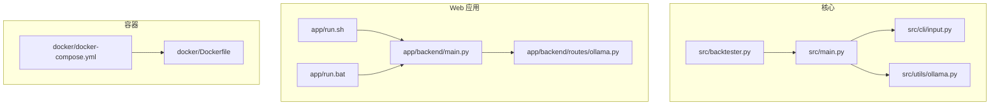
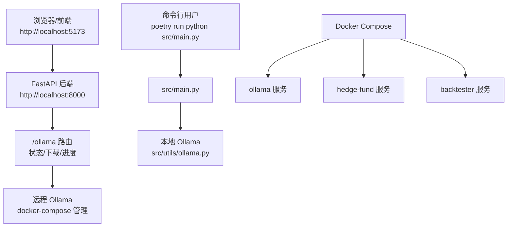
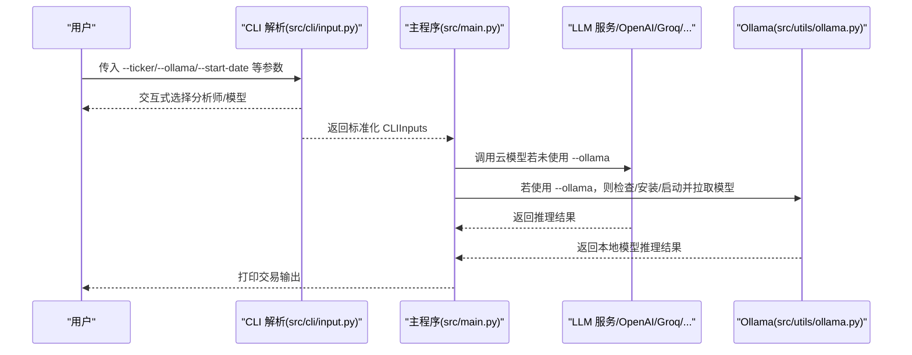
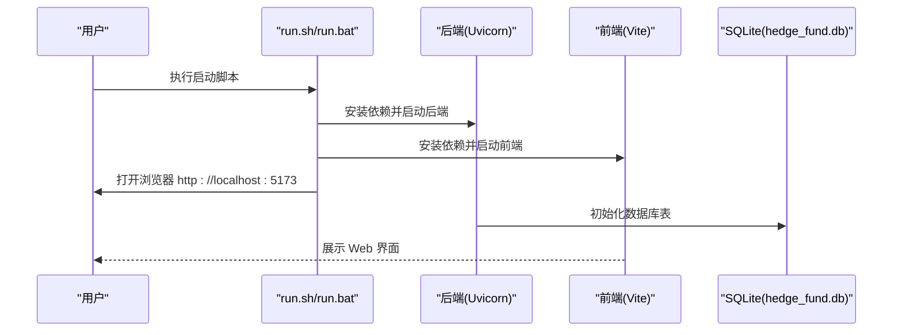
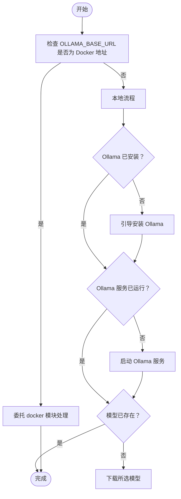
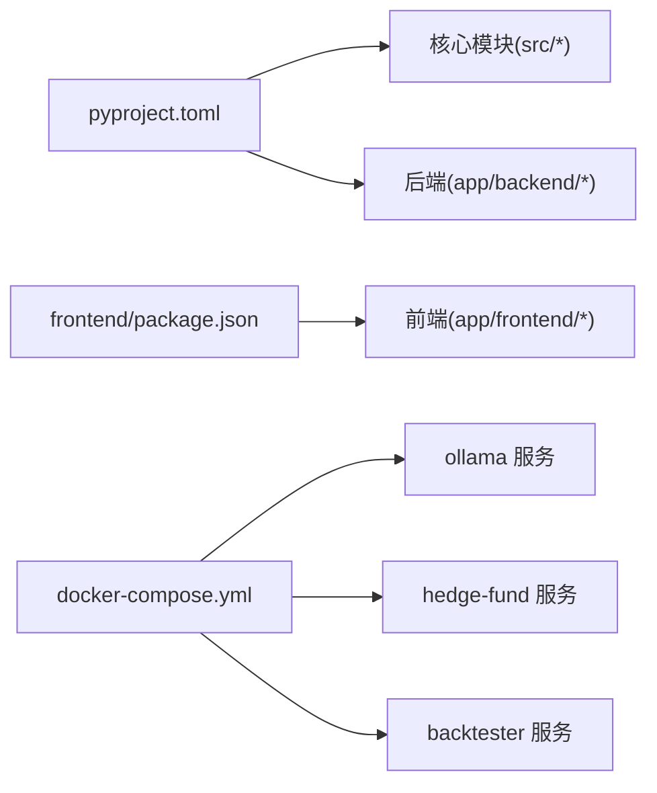

# 快速开始

<cite>
**本文引用的文件**
- [README.md](file://README.md)
- [pyproject.toml](file://pyproject.toml)
- [src/main.py](file://src/main.py)
- [src/backtester.py](file://src/backtester.py)
- [src/cli/input.py](file://src/cli/input.py)
- [src/utils/ollama.py](file://src/utils/ollama.py)
- [app/backend/main.py](file://app/backend/main.py)
- [app/backend/routes/ollama.py](file://app/backend/routes/ollama.py)
- [app/run.sh](file://app/run.sh)
- [app/run.bat](file://app/run.bat)
- [docker/Dockerfile](file://docker/Dockerfile)
- [docker/docker-compose.yml](file://docker/docker-compose.yml)
</cite>

## 目录
1. [简介](#简介)
2. [项目结构](#项目结构)
3. [核心组件](#核心组件)
4. [架构总览](#架构总览)
5. [详细组件分析](#详细组件分析)
6. [依赖关系分析](#依赖关系分析)
7. [性能注意事项](#性能注意事项)
8. [故障排除指南](#故障排除指南)
9. [结论](#结论)
10. [附录](#附录)

## 简介
本指南面向首次接触 AI 对冲基金项目的用户，帮助你在最短时间内完成环境准备、API 密钥配置、两种运行方式（命令行与 Web 应用）启动，并了解本地 LLM 的配置选项与常见问题排查。项目支持通过云模型（如 OpenAI、Groq、Anthropic 等）或本地 Ollama 模型进行推理。

## 项目结构
项目采用多模块组织方式：
- 核心逻辑在 src 目录，包含主程序、回测引擎、CLI 输入解析、LLM 工具与 Ollama 辅助工具
- Web 应用在 app 目录，包含后端 FastAPI 服务与前端 React/Vite 前端
- Docker 支持通过 docker 目录中的 Dockerfile 与 docker-compose.yml 提供容器化运行方案
- 测试位于 tests 目录，覆盖回测与缓存等场景

图表来源
- [src/main.py:133-180](file://src/main.py#L133-L180)
- [src/backtester.py:42-67](file://src/backtester.py#L42-L67)
- [src/cli/input.py:227-289](file://src/cli/input.py#L227-L289)
- [src/utils/ollama.py:311-358](file://src/utils/ollama.py#L311-L358)
- [app/backend/main.py:1-56](file://app/backend/main.py#L1-L56)
- [app/backend/routes/ollama.py:1-319](file://app/backend/routes/ollama.py#L1-L319)
- [app/run.sh:335-379](file://app/run.sh#L335-L379)
- [app/run.bat:1-272](file://app/run.bat#L1-L272)
- [docker/Dockerfile:1-23](file://docker/Dockerfile#L1-L23)
- [docker/docker-compose.yml:1-95](file://docker/docker-compose.yml#L1-L95)

章节来源
- [README.md:54-158](file://README.md#L54-L158)
- [pyproject.toml:1-63](file://pyproject.toml#L1-L63)

## 核心组件
- 主程序入口：负责解析 CLI 参数、构建工作流、调用代理并输出交易决策
- 回测引擎：封装回测流程，支持键盘中断优雅退出并尽可能展示部分结果
- CLI 输入解析：统一处理股票代码、日期范围、分析师选择、模型选择、OLLAMA 选项等
- Ollama 工具：检测/安装/启动本地 Ollama 服务，下载/删除模型，支持 Docker 环境下的远程控制

章节来源
- [src/main.py:46-180](file://src/main.py#L46-L180)
- [src/backtester.py:13-67](file://src/backtester.py#L13-L67)
- [src/cli/input.py:16-289](file://src/cli/input.py#L16-L289)
- [src/utils/ollama.py:37-408](file://src/utils/ollama.py#L37-L408)

## 架构总览
系统分为三层：
- 命令行层：直接运行 Python 脚本，适合自动化与脚本集成
- Web 应用层：后端 FastAPI 提供 REST 接口，前端 Vite+React 提供可视化界面
- 容器层：通过 Dockerfile 与 docker-compose.yml 将应用打包并可选地以 Ollama 作为本地推理服务

图表来源
- [src/main.py:133-180](file://src/main.py#L133-L180)
- [app/backend/main.py:1-56](file://app/backend/main.py#L1-L56)
- [app/backend/routes/ollama.py:1-319](file://app/backend/routes/ollama.py#L1-L319)
- [docker/docker-compose.yml:1-95](file://docker/docker-compose.yml#L1-L95)

## 详细组件分析

### 环境与依赖安装
- Python 版本要求：>= 3.11
- 包管理器：Poetry
- 安装步骤（Linux/macOS）
  - 安装 Poetry：curl -sSL https://install.python-poetry.org | python3 -
  - 在项目根目录执行：poetry install
- 安装步骤（Windows）
  - 使用官方安装器或 pip 安装 Poetry
  - 在项目根目录执行：poetry install

章节来源
- [pyproject.toml:13-51](file://pyproject.toml#L13-L51)
- [README.md:94-102](file://README.md#L94-L102)

### API 密钥配置
- 创建 .env 文件：cp .env.example .env
- 配置项（至少需要一个 LLM 密钥）：
  - OPENAI_API_KEY
  - GROQ_API_KEY
  - ANTHROPIC_API_KEY
  - DEEPSEEK_API_KEY
  - FINANCIAL_DATASETS_API_KEY
- Web 应用中也可通过“设置”页面维护 API Key，后端会从数据库加载有效密钥

章节来源
- [README.md:67-82](file://README.md#L67-L82)
- [app/backend/services/api_key_service.py:12-23](file://app/backend/services/api_key_service.py#L12-L23)
- [app/frontend/src/components/settings/api-keys.tsx:81-123](file://app/frontend/src/components/settings/api-keys.tsx#L81-L123)

### 运行方式一：命令行界面
- 基本运行
  - poetry run python src/main.py --ticker AAPL,MSFT,NVDA
- 可选参数
  - --ollama：使用本地 Ollama 模型
  - --start-date/--end-date：指定回测时间范围
  - --show-reasoning：显示各代理推理内容
  - --show-agent-graph：生成代理图
  - --initial-cash/--initial-capital：初始资金
  - --margin-requirement：卖空保证金比例
- 回测运行
  - poetry run python src/backtester.py --ticker AAPL,MSFT,NVDA

图表来源
- [src/cli/input.py:227-289](file://src/cli/input.py#L227-L289)
- [src/main.py:133-180](file://src/main.py#L133-L180)
- [src/utils/ollama.py:311-358](file://src/utils/ollama.py#L311-L358)

章节来源
- [README.md:104-131](file://README.md#L104-L131)
- [src/cli/input.py:16-289](file://src/cli/input.py#L16-L289)
- [src/main.py:133-180](file://src/main.py#L133-L180)

### 运行方式二：Web 应用
- 自动化脚本（推荐非技术用户）
  - Linux/macOS：在 app/ 目录执行 ./run.sh
  - Windows：在 app\ 目录执行 run.bat
- 手动步骤
  - 后端：cd backend && poetry install；poetry run uvicorn app.backend.main:app --reload --host 127.0.0.1 --port 8000
  - 前端：cd frontend && npm install；npm run dev
- 访问地址
  - 前端：http://localhost:5173
  - 后端 API：http://localhost:8000
  - 文档：http://localhost:8000/docs
  - 数据库：SQLite（项目根目录 hedge_fund.db）

图表来源
- [app/run.sh:335-379](file://app/run.sh#L335-L379)
- [app/run.bat:1-272](file://app/run.bat#L1-L272)
- [app/backend/main.py:17-18](file://app/backend/main.py#L17-L18)

章节来源
- [README.md:132-139](file://README.md#L132-L139)
- [app/backend/main.py:1-56](file://app/backend/main.py#L1-L56)
- [app/run.sh:1-379](file://app/run.sh#L1-L379)
- [app/run.bat:1-272](file://app/run.bat#L1-L272)

### 本地 LLM 配置（Ollama）
- 本地模式
  - 使用 --ollama 启动，CLI 会引导你选择模型并自动检查/安装/启动 Ollama
  - 支持在不同操作系统上安装与启动 Ollama
- 远程模式（Docker）
  - docker-compose 中包含 ollama 服务与 hedge-fund/backtester 服务
  - 通过 OLLAMA_BASE_URL 指向 ollama:11434 或 host.docker.internal:11434
- Web 应用中的 Ollama 管理
  - 后端提供 /ollama 系列接口，支持查询状态、启动/停止、下载/删除模型、实时进度

图表来源
- [src/utils/ollama.py:311-358](file://src/utils/ollama.py#L311-L358)
- [docker/docker-compose.yml:2-61](file://docker/docker-compose.yml#L2-L61)

章节来源
- [src/utils/ollama.py:37-408](file://src/utils/ollama.py#L37-L408)
- [app/backend/routes/ollama.py:1-319](file://app/backend/routes/ollama.py#L1-L319)
- [docker/docker-compose.yml:1-95](file://docker/docker-compose.yml#L1-L95)

## 依赖关系分析
- Python 依赖集中在 pyproject.toml，涵盖 LangChain 生态、FastAPI、SQLAlchemy、绘图与数据处理等
- 前端依赖集中在 app/frontend/package.json，包含 React、Vite、UI 组件库等
- Docker 通过 Dockerfile 安装 Poetry 并安装依赖，docker-compose 将后端、Ollama、回测服务编排

图表来源
- [pyproject.toml:1-63](file://pyproject.toml#L1-L63)
- [app/frontend/package.json:1-56](file://app/frontend/package.json#L1-L56)
- [docker/docker-compose.yml:1-95](file://docker/docker-compose.yml#L1-L95)

章节来源
- [pyproject.toml:1-63](file://pyproject.toml#L1-L63)
- [app/frontend/package.json:1-56](file://app/frontend/package.json#L1-L56)
- [docker/docker-compose.yml:1-95](file://docker/docker-compose.yml#L1-L95)

## 性能注意事项
- 本地 Ollama 下载大模型（如 70B 级别）耗时较长，建议在稳定网络环境下进行
- 回测运行可能受数据量与模型响应时间影响，建议分批测试
- Docker 环境下，Ollama 服务与应用服务分离，便于资源隔离与扩展

## 故障排除指南
- Poetry 安装失败（Windows）
  - 使用管理员权限运行脚本或手动安装
  - 参考脚本中的提示与替代安装方法
- Ollama 无法启动或连接失败
  - 确认 Ollama 服务已启动（本地或 Docker）
  - 检查 OLLAMA_BASE_URL 是否正确指向服务地址
- API 密钥无效或缺失
  - 确保 .env 文件存在且包含至少一个 LLM 密钥
  - Web 应用中可在“设置”页面添加/更新密钥
- 端口占用
  - 默认后端端口 8000、前端端口 5173，如被占用请调整或释放端口
- 权限问题（Windows）
  - 部分安装步骤需要管理员权限，请按脚本提示操作

章节来源
- [app/run.bat:55-122](file://app/run.bat#L55-L122)
- [app/run.sh:95-116](file://app/run.sh#L95-L116)
- [src/utils/ollama.py:114-204](file://src/utils/ollama.py#L114-L204)
- [README.md:67-82](file://README.md#L67-L82)

## 结论
通过本指南，你可以快速完成环境准备、API 密钥配置与两种运行方式的启动。建议优先使用 Web 应用获得更直观的体验，或使用命令行进行自动化与脚本集成。如需本地推理，可通过 Ollama 实现离线模型运行，并结合 Docker 进行部署与扩展。

## 附录
- 常用命令速查
  - 安装依赖：poetry install
  - 启动主程序：poetry run python src/main.py --ticker AAPL,MSFT,NVDA
  - 启动回测：poetry run python src/backtester.py --ticker AAPL,MSFT,NVDA
  - 启动 Web 应用（Linux/macOS）：./app/run.sh
  - 启动 Web 应用（Windows）：app\run.bat
- Docker 编排
  - docker-compose up -d
  - 可选服务：hedge-fund、hedge-fund-reasoning、hedge-fund-ollama、backtester、backtester-ollama

章节来源
- [README.md:94-131](file://README.md#L94-L131)
- [docker/docker-compose.yml:1-95](file://docker/docker-compose.yml#L1-L95)