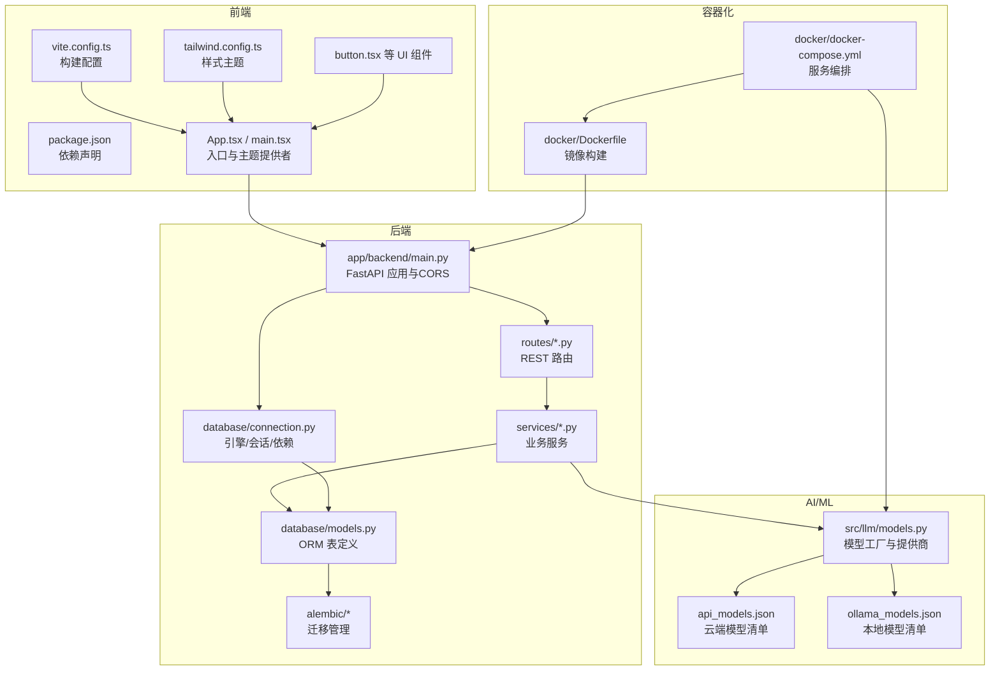
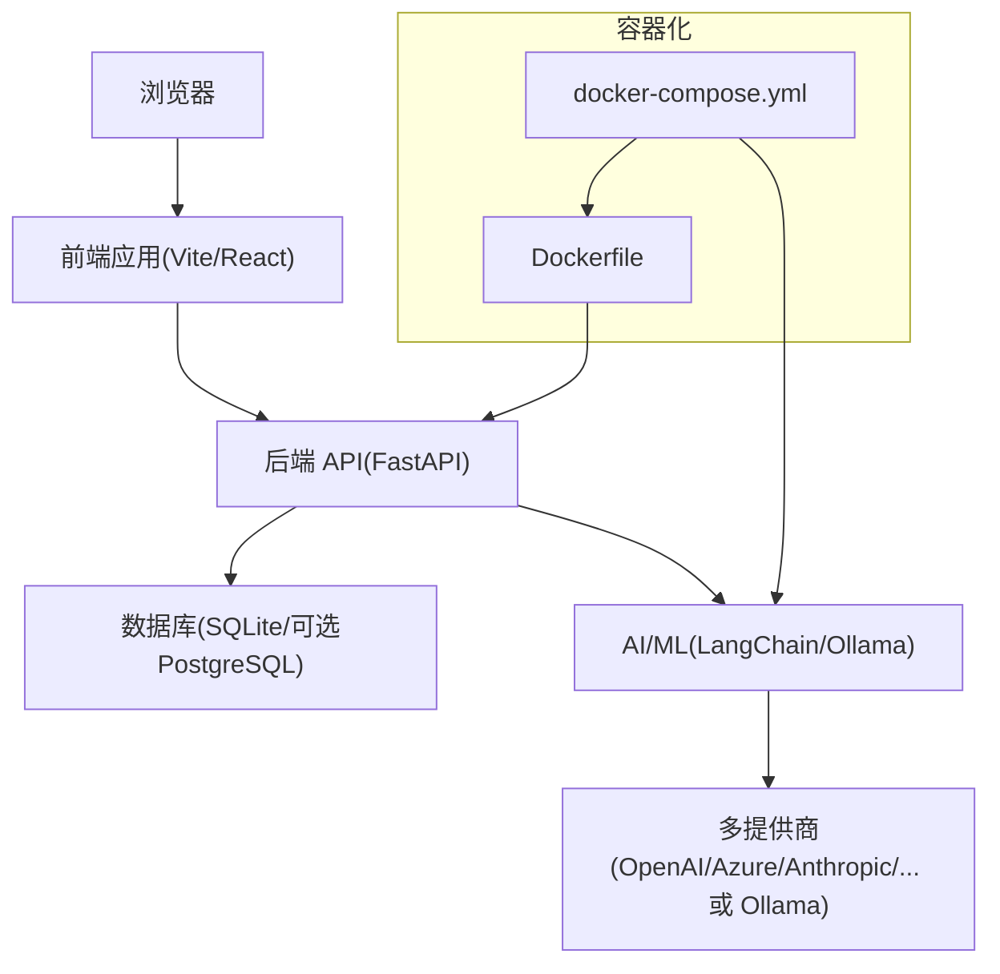
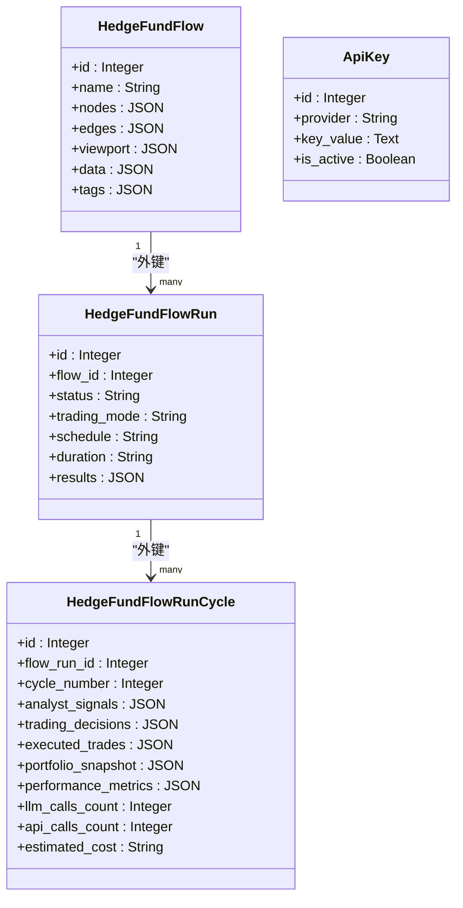
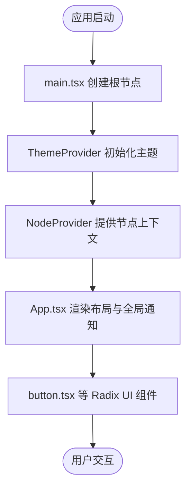
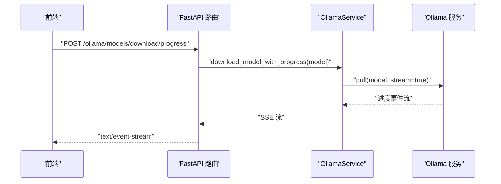
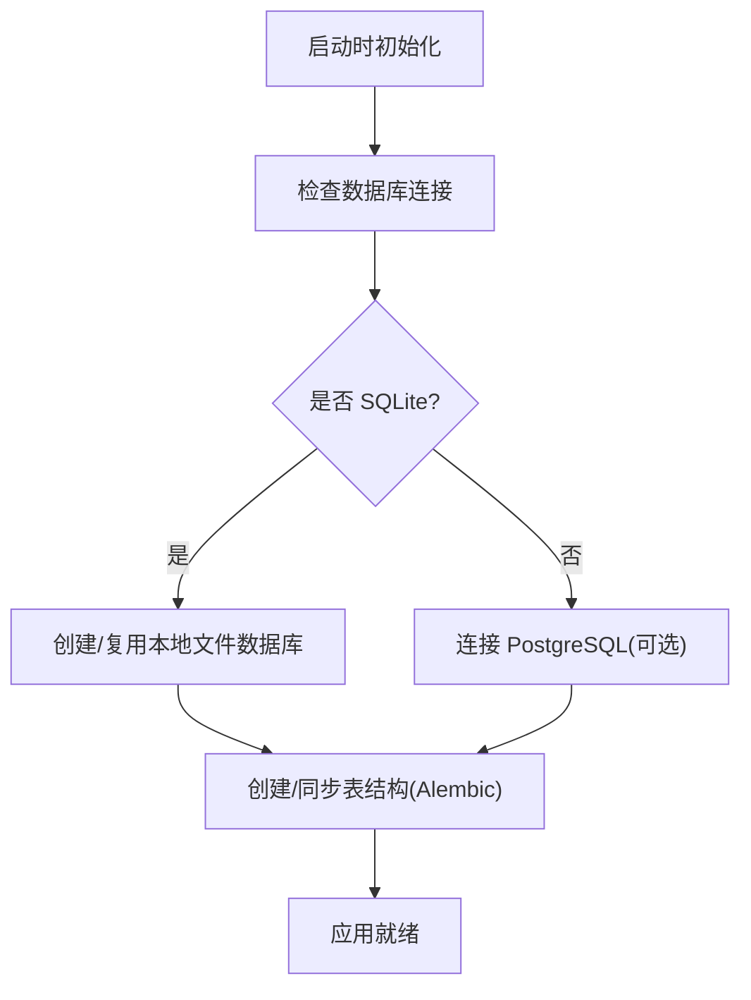
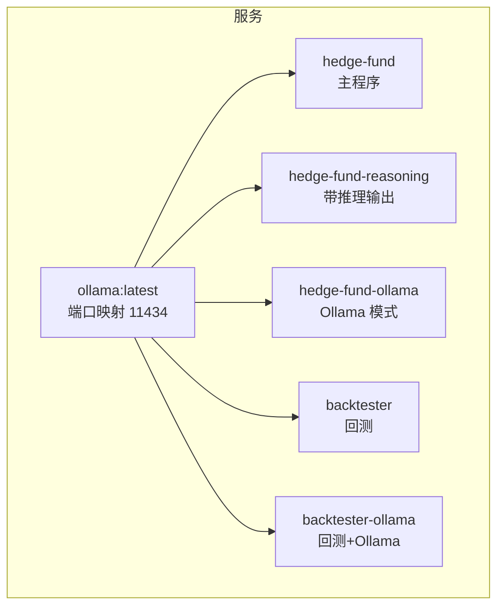
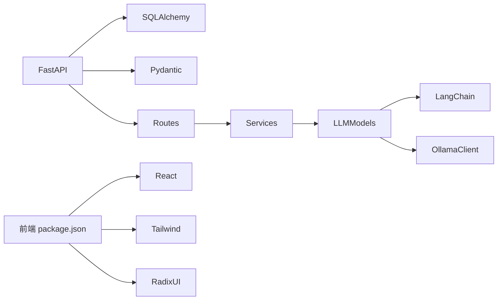

# 技术栈

<cite>
**本文引用的文件**   
- [pyproject.toml](file://pyproject.toml)
- [app/backend/main.py](file://app/backend/main.py)
- [app/backend/database/connection.py](file://app/backend/database/connection.py)
- [app/backend/database/models.py](file://app/backend/database/models.py)
- [app/backend/services/ollama_service.py](file://app/backend/services/ollama_service.py)
- [app/backend/routes/ollama.py](file://app/backend/routes/ollama.py)
- [src/llm/models.py](file://src/llm/models.py)
- [src/llm/api_models.json](file://src/llm/api_models.json)
- [src/llm/ollama_models.json](file://src/llm/ollama_models.json)
- [docker/docker-compose.yml](file://docker/docker-compose.yml)
- [docker/Dockerfile](file://docker/Dockerfile)
- [app/frontend/package.json](file://app/frontend/package.json)
- [app/frontend/tailwind.config.ts](file://app/frontend/tailwind.config.ts)
- [app/frontend/vite.config.ts](file://app/frontend/vite.config.ts)
- [app/frontend/src/components/ui/button.tsx](file://app/frontend/src/components/ui/button.tsx)
- [app/frontend/src/App.tsx](file://app/frontend/src/App.tsx)
- [app/frontend/src/main.tsx](file://app/frontend/src/main.tsx)
</cite>

## 目录
1. [引言](#引言)
2. [项目结构](#项目结构)
3. [核心组件](#核心组件)
4. [架构总览](#架构总览)
5. [详细组件分析](#详细组件分析)
6. [依赖关系分析](#依赖关系分析)
7. [性能考虑](#性能考虑)
8. [故障排查指南](#故障排查指南)
9. [结论](#结论)
10. [附录](#附录)

## 引言
本文件系统性梳理“AI对冲基金”项目的全栈技术栈，覆盖后端（Python、FastAPI、SQLAlchemy、Alembic）、前端（React、Vite、TailwindCSS、Radix UI）、AI/ML（Ollama、LangChain、Pydantic）、数据库（SQLite/PostgreSQL 支持）、容器化（Docker/Docker Compose）与本地开发体验，并解释各技术在项目中的定位与作用。

## 项目结构
项目采用前后端分离与多模块组织方式：
- 后端：基于 FastAPI 的 Python 应用，路由、服务、数据库模型与 Alembic 迁移分层清晰
- 前端：React + TypeScript + Vite，UI 组件基于 Radix UI 与 TailwindCSS
- AI/ML：统一的 LLM 模型抽象与多提供商适配，支持本地 Ollama 与多家云端 LLM
- 数据库：以 SQLAlchemy ORM 映射，当前默认 SQLite，具备迁移到 PostgreSQL 的基础
- 容器化：Dockerfile 与 docker-compose.yml 提供一键运行与可选嵌入式 Ollama

图表来源
- [app/backend/main.py:1-56](file://app/backend/main.py#L1-L56)
- [app/backend/database/connection.py:1-32](file://app/backend/database/connection.py#L1-L32)
- [app/backend/database/models.py:1-115](file://app/backend/database/models.py#L1-L115)
- [app/backend/routes/ollama.py:1-319](file://app/backend/routes/ollama.py#L1-L319)
- [app/backend/services/ollama_service.py:1-519](file://app/backend/services/ollama_service.py#L1-L519)
- [src/llm/models.py:1-258](file://src/llm/models.py#L1-L258)
- [docker/docker-compose.yml:1-95](file://docker/docker-compose.yml#L1-L95)
- [docker/Dockerfile:1-23](file://docker/Dockerfile#L1-L23)
- [app/frontend/package.json:1-56](file://app/frontend/package.json#L1-L56)
- [app/frontend/tailwind.config.ts:1-144](file://app/frontend/tailwind.config.ts#L1-L144)
- [app/frontend/vite.config.ts:1-14](file://app/frontend/vite.config.ts#L1-L14)

章节来源
- [pyproject.toml:1-62](file://pyproject.toml#L1-L62)
- [docker/docker-compose.yml:1-95](file://docker/docker-compose.yml#L1-L95)
- [docker/Dockerfile:1-23](file://docker/Dockerfile#L1-L23)

## 核心组件
- 后端框架与依赖
  - Python 3.11：稳定生态与性能平衡
  - FastAPI：高性能 ASGI 框架，自动生成 OpenAPI 文档，类型安全
  - Pydantic：数据验证与序列化，贯穿请求/响应与配置
  - SQLAlchemy 2.x：现代化 ORM，支持异步与类型提示
  - Alembic：数据库迁移工具链
  - LangChain 生态：多提供商 LLM 集成与图编排
- 前端框架与依赖
  - React 18 + TypeScript：类型安全与组件化
  - Vite：快速构建与热更新
  - TailwindCSS：原子化样式与暗色主题
  - Radix UI：无障碍语义组件
- AI/ML 集成
  - Ollama：本地大模型推理与下载
  - LangChain：多提供商适配与链路编排
  - Pydantic：模型定义与校验
- 数据库
  - 默认 SQLite：开发友好、零运维
  - 可平滑迁移到 PostgreSQL：SQLAlchemy 已抽象
- 容器化
  - Docker：镜像构建与运行
  - Docker Compose：服务编排与可选嵌入式 Ollama

章节来源
- [pyproject.toml:13-40](file://pyproject.toml#L13-L40)
- [app/backend/main.py:1-56](file://app/backend/main.py#L1-L56)
- [app/backend/database/connection.py:1-32](file://app/backend/database/connection.py#L1-L32)
- [app/backend/database/models.py:1-115](file://app/backend/database/models.py#L1-L115)
- [src/llm/models.py:1-258](file://src/llm/models.py#L1-L258)
- [docker/docker-compose.yml:1-95](file://docker/docker-compose.yml#L1-L95)

## 架构总览
后端通过 FastAPI 暴露 REST 接口，前端通过 Vite 开发服务器提供交互界面；AI/ML 通过统一的模型工厂对接多种提供商，数据库采用 SQLAlchemy ORM，容器化提供一致的部署体验。

图表来源
- [app/backend/main.py:15-30](file://app/backend/main.py#L15-L30)
- [app/backend/database/connection.py:12-24](file://app/backend/database/connection.py#L12-L24)
- [src/llm/models.py:142-258](file://src/llm/models.py#L142-L258)
- [docker/docker-compose.yml:18-91](file://docker/docker-compose.yml#L18-L91)

## 详细组件分析

### 后端技术栈（Python/FastAPI/SQLAlchemy/Alembic）
- FastAPI
  - 作用：应用入口、CORS 中间件、路由挂载、启动事件检查 Ollama 状态
  - 关键点：类型注解驱动的自动文档生成；启动时异步检查 Ollama 服务可用性
- SQLAlchemy
  - 作用：连接 SQLite 文件数据库，定义 ORM 表结构，提供依赖注入
  - 关键点：Base.metadata.create_all 在启动时幂等创建表
- Alembic
  - 作用：数据库迁移版本管理，随项目包含迁移脚本
- 数据模型
  - 流程与执行追踪：HedgeFundFlow、HedgeFundFlowRun、HedgeFundFlowRunCycle
  - API 密钥存储：ApiKey
  - JSON 字段用于存储复杂状态（节点、边、视口、中间态）

图表来源
- [app/backend/database/models.py:6-115](file://app/backend/database/models.py#L6-L115)

章节来源
- [app/backend/main.py:15-56](file://app/backend/main.py#L15-L56)
- [app/backend/database/connection.py:12-32](file://app/backend/database/connection.py#L12-L32)
- [app/backend/database/models.py:1-115](file://app/backend/database/models.py#L1-L115)

### 前端技术栈（React/Vite/TailwindCSS/Radix UI）
- React + TypeScript
  - 作用：组件化 UI、上下文与状态管理
- Vite
  - 作用：开发服务器、构建打包、路径别名 @ 指向 src
- TailwindCSS
  - 作用：原子化样式、深色主题变量、插件扩展
- Radix UI
  - 作用：无障碍语义组件（对话框、标签页、工具提示等）
- 典型组件
  - Button：基于 Variance Authority 的变体与尺寸
  - 主题提供者与入口：ThemeProvider 包裹应用根节点

图表来源
- [app/frontend/src/main.tsx:10-18](file://app/frontend/src/main.tsx#L10-L18)
- [app/frontend/src/App.tsx:4-11](file://app/frontend/src/App.tsx#L4-L11)
- [app/frontend/src/components/ui/button.tsx:7-58](file://app/frontend/src/components/ui/button.tsx#L7-L58)
- [app/frontend/vite.config.ts:8-12](file://app/frontend/vite.config.ts#L8-L12)
- [app/frontend/tailwind.config.ts:5-141](file://app/frontend/tailwind.config.ts#L5-L141)

章节来源
- [app/frontend/package.json:11-54](file://app/frontend/package.json#L11-L54)
- [app/frontend/vite.config.ts:1-14](file://app/frontend/vite.config.ts#L1-L14)
- [app/frontend/tailwind.config.ts:1-144](file://app/frontend/tailwind.config.ts#L1-L144)
- [app/frontend/src/components/ui/button.tsx:1-58](file://app/frontend/src/components/ui/button.tsx#L1-L58)
- [app/frontend/src/App.tsx:1-12](file://app/frontend/src/App.tsx#L1-L12)
- [app/frontend/src/main.tsx:1-19](file://app/frontend/src/main.tsx#L1-L19)

### AI/ML 集成（Ollama/LangChain/Pydantic）
- 模型工厂与提供商
  - 统一的 LLMModel Pydantic 模型与 ModelProvider 枚举
  - 多提供商适配：OpenAI、Azure OpenAI、Anthropic、DeepSeek、Google、Groq、OpenRouter、GigaChat、xAI、Ollama 等
  - 从 JSON 配置加载可用模型清单，支持本地与云端模型
- Ollama 集成
  - 后端服务封装：安装检测、服务启停、模型下载/删除/进度流
  - 前端路由：/ollama 系列接口，支持 SSE 实时进度
- 使用场景
  - 交易决策、回测输出解析、新闻情感分析、技术面与基本面分析等

图表来源
- [app/backend/routes/ollama.py:164-195](file://app/backend/routes/ollama.py#L164-L195)
- [app/backend/services/ollama_service.py:93-96](file://app/backend/services/ollama_service.py#L93-L96)
- [app/backend/services/ollama_service.py:405-441](file://app/backend/services/ollama_service.py#L405-L441)

章节来源
- [src/llm/models.py:17-258](file://src/llm/models.py#L17-L258)
- [src/llm/api_models.json:1-87](file://src/llm/api_models.json#L1-L87)
- [src/llm/ollama_models.json:1-57](file://src/llm/ollama_models.json#L1-L57)
- [app/backend/routes/ollama.py:1-319](file://app/backend/routes/ollama.py#L1-L319)
- [app/backend/services/ollama_service.py:1-519](file://app/backend/services/ollama_service.py#L1-L519)

### 数据库技术栈（SQLite 与 PostgreSQL 支持）
- 当前实现
  - SQLite：通过 SQLAlchemy 创建本地文件数据库，适合开发与演示
  - Base.metadata.create_all 在启动时幂等建表
- 迁移与扩展
  - Alembic 已配置，可按需生成/执行迁移
  - 通过修改数据库 URL 与连接参数即可切换至 PostgreSQL

图表来源
- [app/backend/main.py:17-18](file://app/backend/main.py#L17-L18)
- [app/backend/database/connection.py:12-24](file://app/backend/database/connection.py#L12-L24)
- [app/backend/database/models.py:1-115](file://app/backend/database/models.py#L1-L115)

章节来源
- [app/backend/database/connection.py:1-32](file://app/backend/database/connection.py#L1-L32)
- [app/backend/database/models.py:1-115](file://app/backend/database/models.py#L1-L115)

### 容器化技术（Docker 与 Docker Compose）
- Dockerfile
  - 基于 slim Python 3.11，安装 Poetry 并直接安装依赖，设置 PYTHONPATH
- docker-compose.yml
  - 可选嵌入式 Ollama 服务（Apple Silicon GPU 加速环境变量）
  - 多个工作负载：主程序、推理模式、回测等，共享 .env 与 Ollama 基础地址
  - 通过命令行参数传入股票池等运行参数

图表来源
- [docker/Dockerfile:1-23](file://docker/Dockerfile#L1-L23)
- [docker/docker-compose.yml:2-91](file://docker/docker-compose.yml#L2-L91)

章节来源
- [docker/Dockerfile:1-23](file://docker/Dockerfile#L1-L23)
- [docker/docker-compose.yml:1-95](file://docker/docker-compose.yml#L1-L95)

## 依赖关系分析
- 后端依赖
  - FastAPI 依赖 SQLAlchemy（引擎/会话）与 Pydantic（类型与校验）
  - 服务层依赖模型工厂与 LLM 提供商客户端
- 前端依赖
  - React 生态与 Vite 构建工具链
  - TailwindCSS 与 Radix UI 组件库
- AI/ML 依赖
  - LangChain 客户端与 Ollama 客户端
  - 模型清单 JSON 驱动 UI 选择与能力判断

图表来源
- [pyproject.toml:32-37](file://pyproject.toml#L32-L37)
- [app/backend/main.py:1-10](file://app/backend/main.py#L1-L10)
- [src/llm/models.py:1-14](file://src/llm/models.py#L1-L14)
- [app/frontend/package.json:11-54](file://app/frontend/package.json#L11-L54)

章节来源
- [pyproject.toml:13-40](file://pyproject.toml#L13-L40)
- [app/frontend/package.json:1-56](file://app/frontend/package.json#L1-L56)

## 性能考虑
- 后端
  - 使用异步客户端与 SSE 流式下载，避免阻塞
  - 启动事件中仅做轻量检查，不阻塞服务启动
- 数据库
  - SQLite 适合小规模数据与开发；生产建议 PostgreSQL 并启用索引与连接池
- 前端
  - Vite 快速冷启动与热更新；Tailwind 原子化减少样式体积
- AI/ML
  - 通过模型清单与能力判断，避免不支持 JSON Mode 的模型误用
  - Ollama 下载进度流式返回，提升用户体验

## 故障排查指南
- Ollama 未安装或未运行
  - 后端启动日志会提示安装状态与可用模型；可通过 /ollama/start 手动启动
  - docker-compose 可选嵌入式 Ollama 服务
- 模型下载失败
  - 确认 Ollama 服务运行；检查网络与磁盘空间；查看 SSE 进度流错误信息
- 数据库迁移问题
  - 使用 Alembic 生成/升级迁移；确认数据库 URL 与权限
- 前端样式异常
  - 检查 Tailwind 配置与类名拼写；确认主题提供者已正确包裹

章节来源
- [app/backend/main.py:32-56](file://app/backend/main.py#L32-L56)
- [app/backend/routes/ollama.py:65-87](file://app/backend/routes/ollama.py#L65-L87)
- [app/backend/services/ollama_service.py:232-276](file://app/backend/services/ollama_service.py#L232-L276)
- [docker/docker-compose.yml:2-16](file://docker/docker-compose.yml#L2-L16)

## 结论
本项目以 FastAPI 为核心后端，结合 SQLAlchemy 与 Alembic 构建稳健的数据层；前端采用 React/Vite/TailwindCSS/Radix UI 提供现代化交互体验；AI/ML 层通过统一模型工厂与多提供商适配，既支持云端也支持本地 Ollama；数据库默认 SQLite，具备平滑迁移到 PostgreSQL 的能力；容器化提供一键部署与可选嵌入式 Ollama。整体技术栈兼顾易用性、可扩展性与工程化实践。

## 附录
- 关键文件速览
  - 后端入口与中间件：[app/backend/main.py:1-56](file://app/backend/main.py#L1-L56)
  - 数据库连接与模型：[app/backend/database/connection.py:1-32](file://app/backend/database/connection.py#L1-L32)、[app/backend/database/models.py:1-115](file://app/backend/database/models.py#L1-L115)
  - Ollama 路由与服务：[app/backend/routes/ollama.py:1-319](file://app/backend/routes/ollama.py#L1-L319)、[app/backend/services/ollama_service.py:1-519](file://app/backend/services/ollama_service.py#L1-L519)
  - LLM 模型与提供商：[src/llm/models.py:1-258](file://src/llm/models.py#L1-L258)、[src/llm/api_models.json:1-87](file://src/llm/api_models.json#L1-L87)、[src/llm/ollama_models.json:1-57](file://src/llm/ollama_models.json#L1-L57)
  - 前端依赖与配置：[app/frontend/package.json:1-56](file://app/frontend/package.json#L1-L56)、[app/frontend/tailwind.config.ts:1-144](file://app/frontend/tailwind.config.ts#L1-L144)、[app/frontend/vite.config.ts:1-14](file://app/frontend/vite.config.ts#L1-L14)
  - 容器化：[docker/Dockerfile:1-23](file://docker/Dockerfile#L1-L23)、[docker/docker-compose.yml:1-95](file://docker/docker-compose.yml#L1-L95)