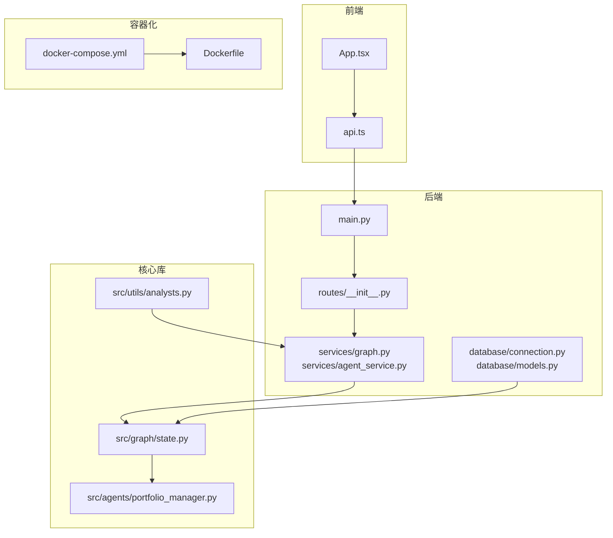
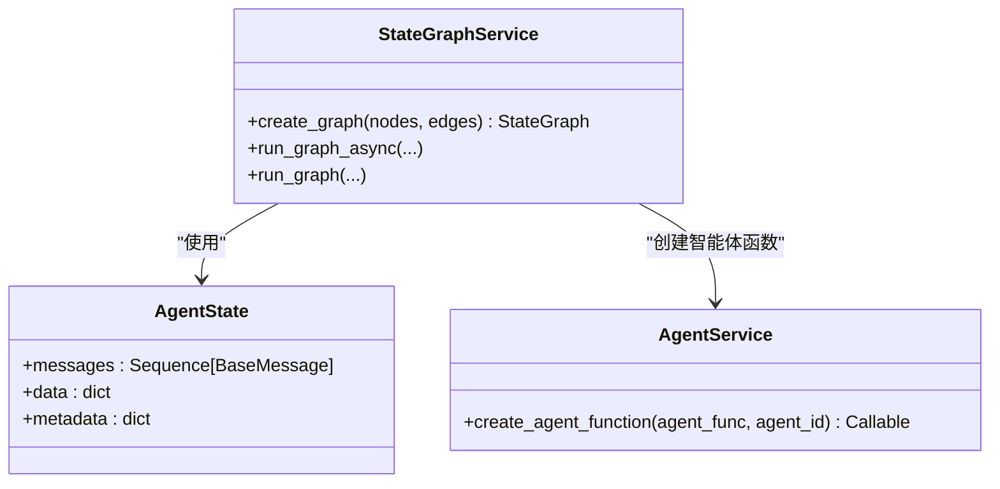
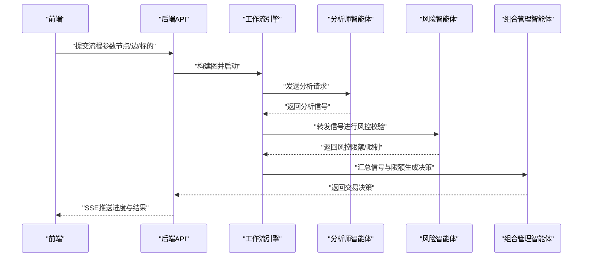
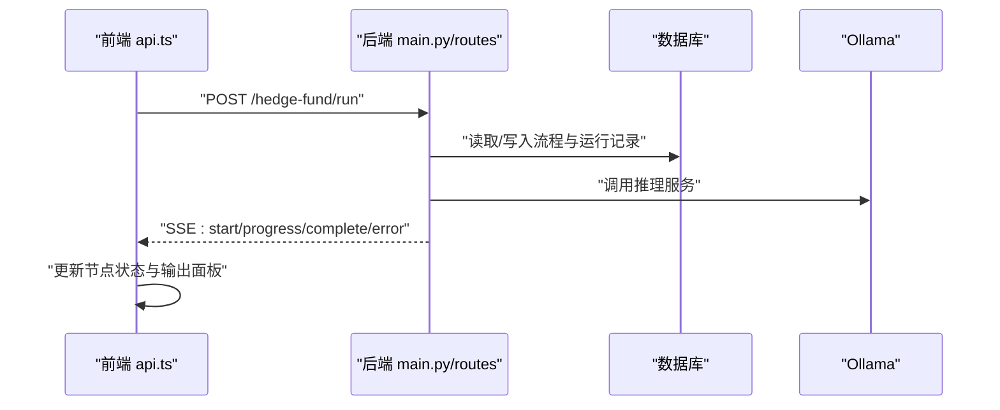
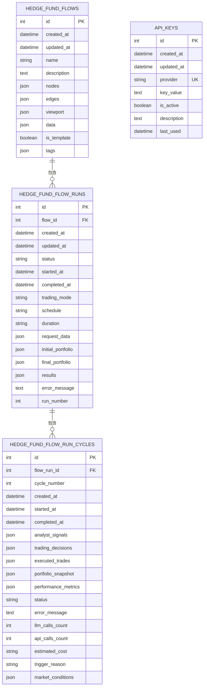
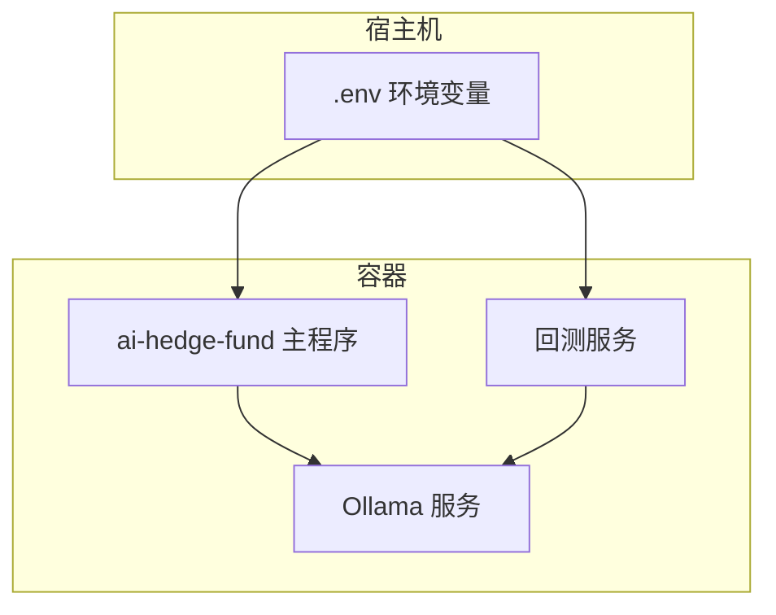
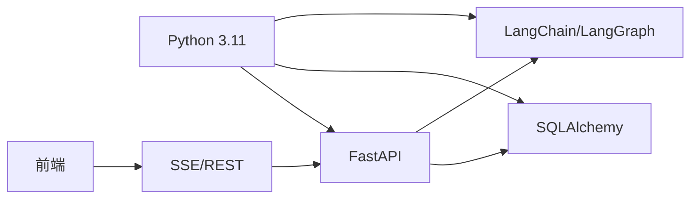

# 架构设计

<cite>
**本文引用的文件**
- [app/backend/main.py](file://app/backend/main.py)
- [app/backend/routes/__init__.py](file://app/backend/routes/__init__.py)
- [app/backend/database/connection.py](file://app/backend/database/connection.py)
- [app/backend/database/models.py](file://app/backend/database/models.py)
- [app/backend/services/graph.py](file://app/backend/services/graph.py)
- [app/backend/services/agent_service.py](file://app/backend/services/agent_service.py)
- [src/graph/state.py](file://src/graph/state.py)
- [src/utils/analysts.py](file://src/utils/analysts.py)
- [src/agents/portfolio_manager.py](file://src/agents/portfolio_manager.py)
- [app/frontend/src/App.tsx](file://app/frontend/src/App.tsx)
- [app/frontend/src/services/api.ts](file://app/frontend/src/services/api.ts)
- [docker/docker-compose.yml](file://docker/docker-compose.yml)
- [docker/Dockerfile](file://docker/Dockerfile)
- [pyproject.toml](file://pyproject.toml)
</cite>

## 目录
1. [引言](#引言)
2. [项目结构](#项目结构)
3. [核心组件](#核心组件)
4. [架构总览](#架构总览)
5. [详细组件分析](#详细组件分析)
6. [依赖分析](#依赖分析)
7. [性能考虑](#性能考虑)
8. [故障排查指南](#故障排查指南)
9. [结论](#结论)
10. [附录](#附录)

## 引言
本项目是一个“AI对冲基金”系统，目标是通过多智能体（Agent）与状态图（StateGraph）工作流引擎，构建一个可配置、可观测、可扩展的交易决策与回测平台。系统采用前后端分离架构：前端使用现代Web技术栈，后端基于FastAPI提供REST与Server-Sent Events（SSE）流式接口；数据库采用SQLite并通过SQLAlchemy ORM进行建模；容器化部署通过Docker与Compose实现本地与开发环境的一致性。

在架构设计上，系统融合了以下理念：
- 分层架构：清晰划分表现层（前端）、应用层（FastAPI路由与服务）、领域层（智能体与工作流）、基础设施层（数据库与容器）
- 微服务化思路：以功能模块（Agent、Backtest、Storage等）为边界，通过API与事件进行解耦
- 事件驱动：通过SSE向前端推送执行进度与结果，实现近实时的可视化反馈
- 状态驱动：以LangGraph的状态图作为工作流编排核心，统一管理消息、数据与元信息

## 项目结构
项目采用“根目录/src + 应用层/app + 容器化/docker”的组织方式：
- 核心业务逻辑位于 src/（智能体、回测、工具、图状态等）
- 后端应用位于 app/backend/（FastAPI、路由、服务、数据库）
- 前端应用位于 app/frontend/（React/Vite、UI组件、服务封装）
- 容器化位于 docker/（Dockerfile、docker-compose）



图表来源
- [app/backend/main.py:1-56](file://app/backend/main.py#L1-L56)
- [app/backend/routes/__init__.py:1-24](file://app/backend/routes/__init__.py#L1-L24)
- [app/backend/database/connection.py:1-32](file://app/backend/database/connection.py#L1-L32)
- [app/backend/database/models.py:1-115](file://app/backend/database/models.py#L1-L115)
- [app/backend/services/graph.py:1-193](file://app/backend/services/graph.py#L1-L193)
- [app/backend/services/agent_service.py:1-13](file://app/backend/services/agent_service.py#L1-L13)
- [src/graph/state.py:1-52](file://src/graph/state.py#L1-L52)
- [src/agents/portfolio_manager.py:1-263](file://src/agents/portfolio_manager.py#L1-L263)
- [src/utils/analysts.py:1-201](file://src/utils/analysts.py#L1-L201)
- [app/frontend/src/App.tsx:1-12](file://app/frontend/src/App.tsx#L1-L12)
- [app/frontend/src/services/api.ts:1-309](file://app/frontend/src/services/api.ts#L1-L309)
- [docker/docker-compose.yml:1-95](file://docker/docker-compose.yml#L1-L95)
- [docker/Dockerfile:1-23](file://docker/Dockerfile#L1-L23)

章节来源
- [app/backend/main.py:1-56](file://app/backend/main.py#L1-L56)
- [app/backend/routes/__init__.py:1-24](file://app/backend/routes/__init__.py#L1-L24)
- [app/frontend/src/App.tsx:1-12](file://app/frontend/src/App.tsx#L1-L12)
- [docker/docker-compose.yml:1-95](file://docker/docker-compose.yml#L1-L95)

## 核心组件
- 状态图工作流引擎：以LangGraph为核心，定义AgentState，构建从起始节点到各分析师与风险/组合管理节点的有向无环或有环图，并通过invoke驱动状态流转
- 多智能体系统：通过统一的智能体函数签名与唯一ID机制，支持动态注入与连接，形成“分析师—风险经理—组合经理”的协作链路
- 数据模型与持久化：基于SQLAlchemy ORM的SQLite数据库，存储流程配置、运行记录、周期分析与密钥信息
- 前后端交互：前端通过SSE接收后端流式事件，实时更新节点状态与输出面板
- 容器化与环境：Dockerfile与docker-compose提供一致的运行环境，支持本地Ollama集成与多种运行模式

章节来源
- [app/backend/services/graph.py:1-193](file://app/backend/services/graph.py#L1-L193)
- [src/graph/state.py:1-52](file://src/graph/state.py#L1-L52)
- [src/utils/analysts.py:1-201](file://src/utils/analysts.py#L1-L201)
- [app/backend/database/models.py:1-115](file://app/backend/database/models.py#L1-L115)
- [app/frontend/src/services/api.ts:1-309](file://app/frontend/src/services/api.ts#L1-L309)
- [docker/docker-compose.yml:1-95](file://docker/docker-compose.yml#L1-L95)

## 架构总览
系统采用“前端渲染 + 后端编排 + 数据持久化 + 容器化交付”的整体架构。后端通过FastAPI提供REST与SSE能力，前端负责可视化与用户交互；工作流引擎负责跨智能体的协调与状态推进；数据库用于保存流程与运行历史；容器化确保开发与运行环境一致性。

```mermaid
graph TB
Client["浏览器/桌面客户端"] --> API["FastAPI 路由层"]
API --> Graph["LangGraph 工作流引擎"]
Graph --> Agents["智能体集合分析师/风险/组合"]
API --> DB["SQLAlchemy ORM + SQLite"]
API --> Ollama["Ollama 推理服务"]
Client <- --> SSE["SSE 流式事件"]
Docker["Docker 容器化"] --> API
Docker --> Ollama
```

图表来源
- [app/backend/main.py:1-56](file://app/backend/main.py#L1-L56)
- [app/backend/services/graph.py:1-193](file://app/backend/services/graph.py#L1-L193)
- [app/backend/database/connection.py:1-32](file://app/backend/database/connection.py#L1-L32)
- [docker/docker-compose.yml:1-95](file://docker/docker-compose.yml#L1-L95)

## 详细组件分析

### 状态图工作流引擎（StateGraph）
- 设计原理
  - 使用TypedDict定义AgentState，包含消息序列、共享数据与元信息，支持多智能体间的数据合并与传递
  - 通过StateGraph构建节点与边，入口为“start_node”，分析师节点与风险/组合管理节点按规则连接，最终汇聚至END
  - 提供异步包装器run_graph_async，避免阻塞事件循环
- 实现机制
  - 从React Flow图结构解析节点与边，动态生成智能体函数并注册到图中
  - 对“分析师→组合经理”的直接连接进行重定向，强制经“风险经理”中转，保证风控前置
  - invoke时注入时间窗口、标的、初始/最终投资组合、请求上下文等信息
- 关键路径
  - [src/graph/state.py:14-19](file://src/graph/state.py#L14-L19)
  - [app/backend/services/graph.py:36-129](file://app/backend/services/graph.py#L36-L129)
  - [app/backend/services/graph.py:141-177](file://app/backend/services/graph.py#L141-L177)



图表来源
- [src/graph/state.py:14-19](file://src/graph/state.py#L14-L19)
- [app/backend/services/graph.py:36-129](file://app/backend/services/graph.py#L36-L129)
- [app/backend/services/agent_service.py:5-13](file://app/backend/services/agent_service.py#L5-L13)

章节来源
- [src/graph/state.py:1-52](file://src/graph/state.py#L1-L52)
- [app/backend/services/graph.py:1-193](file://app/backend/services/graph.py#L1-L193)
- [app/backend/services/agent_service.py:1-13](file://app/backend/services/agent_service.py#L1-L13)

### 多智能体系统与协作机制
- 智能体注册与配置
  - 统一的ANALYST_CONFIG集中管理所有分析师智能体的显示名、描述、类型与顺序
  - 通过create_agent_function为每个节点实例绑定唯一ID，确保可追踪与可复用
- 协作链路
  - 分析师节点 → 风险管理节点 → 组合管理节点 → 结束
  - “分析师→组合经理”的直接边被转换为“分析师→风险管理→组合管理”，强化风控前置
- 决策生成
  - 组合管理节点汇总各分析师信号与风控限额，调用LLM生成最终交易决策
  - 支持预填充“持有”决策，减少Token消耗并提升确定性



图表来源
- [app/backend/services/graph.py:36-129](file://app/backend/services/graph.py#L36-L129)
- [src/agents/portfolio_manager.py:25-93](file://src/agents/portfolio_manager.py#L25-L93)
- [src/utils/analysts.py:24-178](file://src/utils/analysts.py#L24-L178)

章节来源
- [src/utils/analysts.py:1-201](file://src/utils/analysts.py#L1-L201)
- [app/backend/services/agent_service.py:1-13](file://app/backend/services/agent_service.py#L1-L13)
- [src/agents/portfolio_manager.py:1-263](file://src/agents/portfolio_manager.py#L1-L263)

### 前后端分离与API设计
- 前端职责
  - 布局与UI组件、节点状态管理、SSE事件解析与可视化更新
  - 通过api.ts封装HTTP与SSE调用，统一错误处理与连接生命周期管理
- 后端职责
  - FastAPI应用初始化、CORS配置、数据库表初始化
  - 路由聚合（健康检查、流程、运行、存储、语言模型、API密钥、Ollama）
  - SSE流式响应，按事件类型推送进度、完成与错误信息
- 数据流
  - 前端发起POST请求，后端返回SSE流，前端逐条解析事件并更新节点状态



图表来源
- [app/frontend/src/services/api.ts:87-309](file://app/frontend/src/services/api.ts#L87-L309)
- [app/backend/main.py:15-56](file://app/backend/main.py#L15-L56)
- [app/backend/routes/__init__.py:12-24](file://app/backend/routes/__init__.py#L12-L24)

章节来源
- [app/frontend/src/App.tsx:1-12](file://app/frontend/src/App.tsx#L1-12)
- [app/frontend/src/services/api.ts:1-309](file://app/frontend/src/services/api.ts#L1-L309)
- [app/backend/main.py:1-56](file://app/backend/main.py#L1-L56)
- [app/backend/routes/__init__.py:1-24](file://app/backend/routes/__init__.py#L1-L24)

### 数据库架构与ORM映射
- 表设计
  - HedgeFundFlow：存储React Flow配置（节点、边、视口、内部数据与标签）
  - HedgeFundFlowRun：单次运行记录（状态、调度、持续时间、请求与结果）
  - HedgeFundFlowRunCycle：交易会话内的分析周期（信号、决策、成交、快照、指标、成本）
  - ApiKey：第三方服务密钥（提供商、值、启用状态、描述、最后使用时间）
- ORM映射
  - 使用declarative_base与Column定义字段，JSON列用于存储复杂对象
  - 通过SessionLocal与get_db提供依赖注入
- 设计理由
  - 将流程与运行历史解耦，便于模板化复用与审计
  - JSON列承载灵活的数据结构，适配不同智能体的输出格式
  - 通过外键关联保证运行与周期的完整性



图表来源
- [app/backend/database/models.py:6-115](file://app/backend/database/models.py#L6-L115)
- [app/backend/database/connection.py:14-32](file://app/backend/database/connection.py#L14-L32)

章节来源
- [app/backend/database/models.py:1-115](file://app/backend/database/models.py#L1-L115)
- [app/backend/database/connection.py:1-32](file://app/backend/database/connection.py#L1-L32)

### 容器化部署与环境配置
- Dockerfile
  - 基于python:3.11-slim，安装Poetry并以非虚拟环境方式安装依赖
  - 设置PYTHONPATH，复制源码，设置默认命令
- docker-compose
  - 提供Ollama服务（可选嵌入式配置），以及多个服务实例（主程序、推理模式、回测等）
  - 通过环境变量传递OLLAMA_BASE_URL，挂载.env文件，暴露11434端口
- 设计理由
  - 通过Compose统一服务编排，便于本地开发与测试
  - 将Ollama作为可选依赖，降低部署门槛
  - 支持多种运行模式（CLI、SSE、回测），满足不同场景需求



图表来源
- [docker/Dockerfile:1-23](file://docker/Dockerfile#L1-L23)
- [docker/docker-compose.yml:1-95](file://docker/docker-compose.yml#L1-L95)

章节来源
- [docker/Dockerfile:1-23](file://docker/Dockerfile#L1-L23)
- [docker/docker-compose.yml:1-95](file://docker/docker-compose.yml#L1-L95)

## 依赖分析
- 技术栈与版本
  - Python 3.11，Poetry管理依赖
  - FastAPI、SQLAlchemy、Alembic、LangChain/LangGraph系列
  - 前端使用Vite/React与TailwindCSS
- 组件耦合
  - 后端路由聚合器集中管理子路由，降低入口复杂度
  - 工作流引擎与智能体解耦，通过函数签名与唯一ID连接
  - 前后端通过SSE事件解耦，前端仅依赖事件协议



图表来源
- [pyproject.toml:13-42](file://pyproject.toml#L13-L42)

章节来源
- [pyproject.toml:1-63](file://pyproject.toml#L1-L63)

## 性能考虑
- 并发与阻塞
  - 工作流执行通过线程池异步包装，避免阻塞事件循环
  - SSE流式推送减少一次性大响应带来的延迟
- Token与成本控制
  - 组合管理节点预填充“持有”决策，减少LLM调用次数
  - 严格限定允许动作与数量，降低提示词复杂度
- 存储与查询
  - JSON列用于灵活存储，建议在高频查询字段上增加索引或拆分表结构
  - 运行记录与周期表分离，便于分页与归档

## 故障排查指南
- Ollama可用性检查
  - 后端启动时检查Ollama安装与运行状态，若未安装或未运行，记录日志并提示
- SSE连接异常
  - 前端捕获AbortError与未知错误，统一标记节点状态为ERROR，并更新连接状态
  - 若后端提前关闭连接，前端检测并标记为completed兜底
- 数据库初始化
  - 启动时自动创建表，确保多次运行的安全性
- 解析错误
  - 工作流响应解析包含JSON解码与类型检查，失败时打印详细信息便于定位

章节来源
- [app/backend/main.py:32-56](file://app/backend/main.py#L32-L56)
- [app/frontend/src/services/api.ts:272-295](file://app/frontend/src/services/api.ts#L272-L295)
- [app/backend/database/connection.py:17-18](file://app/backend/database/connection.py#L17-L18)
- [app/backend/services/graph.py:180-193](file://app/backend/services/graph.py#L180-L193)

## 结论
该架构以“状态图工作流 + 多智能体 + SSE事件驱动 + ORM持久化 + 容器化部署”为核心，实现了从策略配置、执行监控到结果可视化的完整闭环。通过清晰的分层与模块化设计，系统具备良好的可扩展性与可维护性，适合在本地与云环境中快速迭代与部署。

## 附录
- 快速启动建议
  - 使用docker-compose启动Ollama与主服务，确保端口与环境变量正确
  - 在前端设置VITE_API_URL指向后端地址，保证SSE连通
- 扩展方向
  - 引入消息队列（如Celery/RQ）实现后台任务与重试
  - 增加鉴权与速率限制中间件
  - 将SQLite替换为PostgreSQL以支撑更高并发与复杂查询