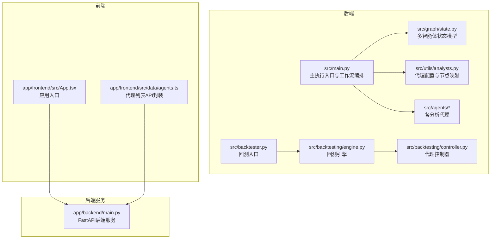
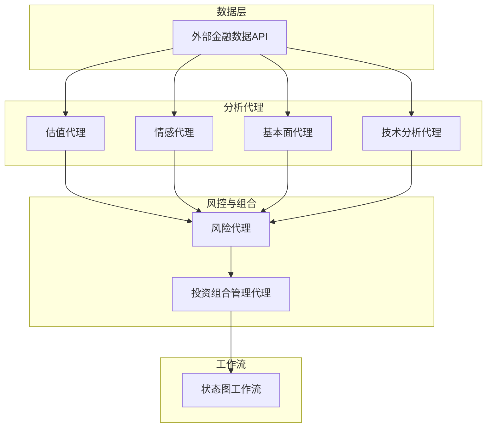
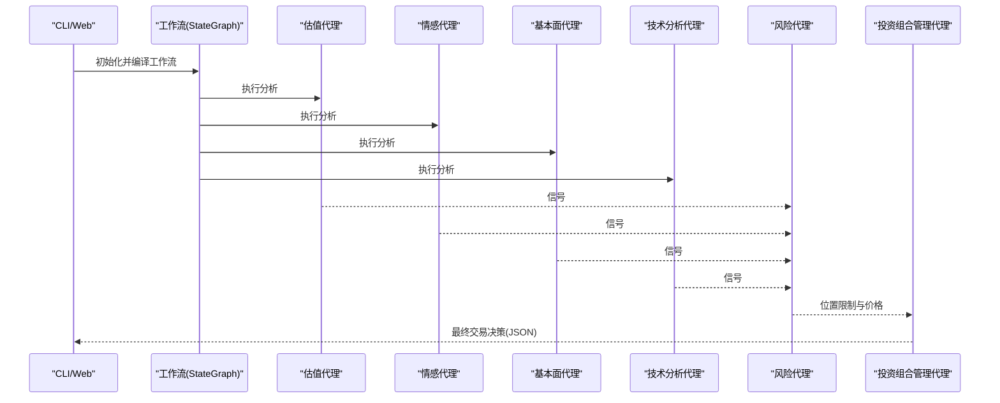
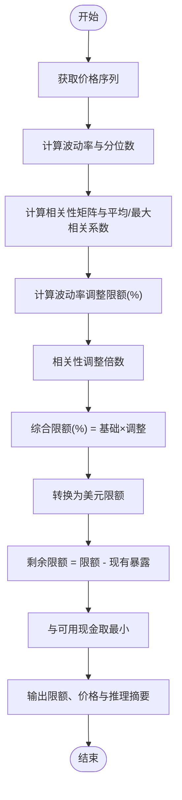
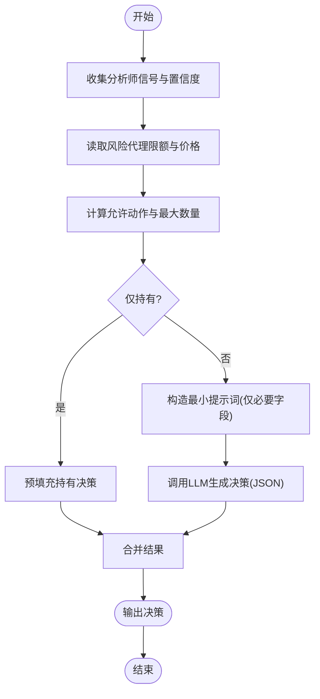
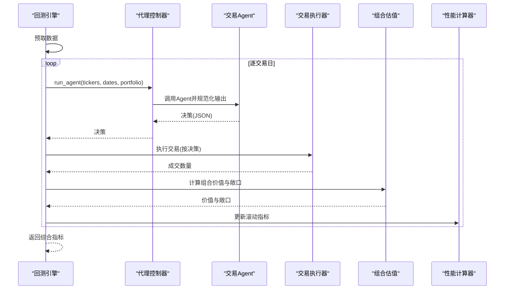
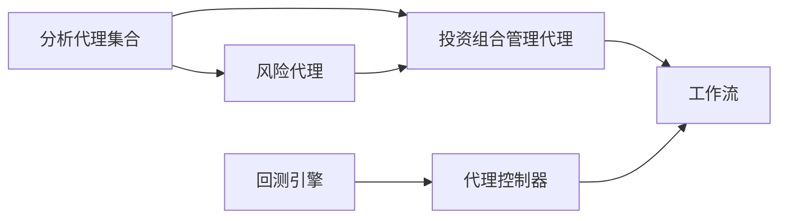

# 核心功能

<cite>
**本文引用的文件**
- [src/main.py](file://src/main.py)
- [src/backtester.py](file://src/backtester.py)
- [src/graph/state.py](file://src/graph/state.py)
- [src/utils/analysts.py](file://src/utils/analysts.py)
- [src/agents/portfolio_manager.py](file://src/agents/portfolio_manager.py)
- [src/agents/risk_manager.py](file://src/agents/risk_manager.py)
- [src/agents/valuation.py](file://src/agents/valuation.py)
- [src/agents/sentiment.py](file://src/agents/sentiment.py)
- [src/agents/fundamentals.py](file://src/agents/fundamentals.py)
- [src/agents/technicals.py](file://src/agents/technicals.py)
- [src/backtesting/engine.py](file://src/backtesting/engine.py)
- [src/backtesting/controller.py](file://src/backtesting/controller.py)
- [app/backend/main.py](file://app/backend/main.py)
- [README.md](file://README.md)
- [app/frontend/src/data/agents.ts](file://app/frontend/src/data/agents.ts)
</cite>

## 目录
1. [简介](#简介)
2. [项目结构](#项目结构)
3. [核心组件](#核心组件)
4. [架构总览](#架构总览)
5. [详细组件分析](#详细组件分析)
6. [依赖分析](#依赖分析)
7. [性能考虑](#性能考虑)
8. [故障排查指南](#故障排查指南)
9. [结论](#结论)
10. [附录](#附录)

## 简介
本项目是一个面向教育研究目的的AI多智能体对冲基金决策系统，通过多个“投资大师”智能体协同工作，结合估值、情感、基本面与技术分析代理，形成完整的投资决策链路，并由风险管理与投资组合管理代理进行最终整合与下单决策。系统同时提供回测引擎用于策略验证与性能评估，并通过Web应用与命令行两种方式运行。

## 项目结构
- 后端（Python）：核心交易流程、代理、回测、状态与工具
- 前端（React）：可视化工作流与配置界面
- 应用入口：CLI与Web后端服务

图表来源
- [src/main.py:1-180](file://src/main.py#L1-L180)
- [src/graph/state.py:1-52](file://src/graph/state.py#L1-L52)
- [src/utils/analysts.py:1-201](file://src/utils/analysts.py#L1-L201)
- [src/backtesting/engine.py:1-195](file://src/backtesting/engine.py#L1-L195)
- [src/backtesting/controller.py:1-68](file://src/backtesting/controller.py#L1-L68)
- [app/backend/main.py:1-56](file://app/backend/main.py#L1-L56)
- [app/frontend/src/App.tsx:1-12](file://app/frontend/src/App.tsx#L1-L12)
- [app/frontend/src/data/agents.ts:1-31](file://app/frontend/src/data/agents.ts#L1-L31)

章节来源
- [src/main.py:1-180](file://src/main.py#L1-L180)
- [src/backtester.py:1-67](file://src/backtester.py#L1-L67)
- [src/graph/state.py:1-52](file://src/graph/state.py#L1-L52)
- [src/utils/analysts.py:1-201](file://src/utils/analysts.py#L1-L201)
- [src/backtesting/engine.py:1-195](file://src/backtesting/engine.py#L1-L195)
- [src/backtesting/controller.py:1-68](file://src/backtesting/controller.py#L1-L68)
- [app/backend/main.py:1-56](file://app/backend/main.py#L1-L56)
- [app/frontend/src/App.tsx:1-12](file://app/frontend/src/App.tsx#L1-L12)
- [app/frontend/src/data/agents.ts:1-31](file://app/frontend/src/data/agents.ts#L1-L31)

## 核心组件
- 多智能体工作流与状态
  - 使用LangGraph状态图定义“开始节点”到各分析师节点，再汇聚至风险管理与投资组合管理节点，最终结束。
  - 状态包含消息序列、数据字典与元数据，支持逐步累积信号与推理输出。
- 投资大师智能体（19位）
  - 价值类：Aswath Damodaran、Ben Graham、Warren Buffett、Michael Burry、Charlie Munger、Mohnish Pabrai、Phil Fisher、Peter Lynch、Rakesh Jhunjhunwala、Stanley Druckenmiller、Nassim Taleb
  - 分析代理：估值代理、情感代理、基本面代理、技术分析代理
  - 风险管理与投资组合管理代理
- 回测引擎
  - 按交易日推进，预取数据，执行交易，计算组合价值与敞口，输出每日明细与基准对比，最后计算夏普率、最大回撤等指标。
- 工作流引擎
  - 将CLI或Web输入转化为统一Agent调用，规范化输出格式，供回测与实时运行复用。

章节来源
- [src/main.py:100-130](file://src/main.py#L100-L130)
- [src/graph/state.py:14-19](file://src/graph/state.py#L14-L19)
- [README.md:5-26](file://README.md#L5-L26)
- [src/backtesting/engine.py:27-195](file://src/backtesting/engine.py#L27-L195)
- [src/backtesting/controller.py:9-68](file://src/backtesting/controller.py#L9-L68)

## 架构总览
系统采用“代理+状态图”的多智能体架构，数据从外部API获取，经由分析代理生成信号，风险管理代理给出头寸限制，投资组合管理代理汇总信号并生成最终交易指令；回测引擎以相同Agent接口驱动历史回放，产出性能报告。

图表来源
- [src/main.py:100-130](file://src/main.py#L100-L130)
- [src/agents/valuation.py:21-221](file://src/agents/valuation.py#L21-L221)
- [src/agents/sentiment.py:12-139](file://src/agents/sentiment.py#L12-L139)
- [src/agents/fundamentals.py:11-164](file://src/agents/fundamentals.py#L11-L164)
- [src/agents/technicals.py:35-157](file://src/agents/technicals.py#L35-L157)
- [src/agents/risk_manager.py:11-220](file://src/agents/risk_manager.py#L11-L220)
- [src/agents/portfolio_manager.py:25-94](file://src/agents/portfolio_manager.py#L25-L94)

## 详细组件分析

### 工作流引擎与状态图
- 节点构建：根据选择的分析师集合动态添加节点，起始节点连接所有分析师，分析师汇聚到风险代理，风险代理再连接投资组合管理代理。
- 状态模型：消息、数据、元数据三段式，支持逐步合并与序列化输出。
- 推理展示：可选打印各代理的推理过程，便于调试与教学演示。

图表来源
- [src/main.py:100-130](file://src/main.py#L100-L130)
- [src/graph/state.py:14-19](file://src/graph/state.py#L14-L19)
- [src/agents/valuation.py:21-221](file://src/agents/valuation.py#L21-L221)
- [src/agents/sentiment.py:12-139](file://src/agents/sentiment.py#L12-L139)
- [src/agents/fundamentals.py:11-164](file://src/agents/fundamentals.py#L11-L164)
- [src/agents/technicals.py:35-157](file://src/agents/technicals.py#L35-L157)
- [src/agents/risk_manager.py:11-220](file://src/agents/risk_manager.py#L11-L220)
- [src/agents/portfolio_manager.py:25-94](file://src/agents/portfolio_manager.py#L25-L94)

章节来源
- [src/main.py:100-130](file://src/main.py#L100-L130)
- [src/graph/state.py:14-52](file://src/graph/state.py#L14-L52)

### 风险管理代理
- 功能要点
  - 获取价格序列，计算波动率、年化波动率与分位数
  - 计算相关性矩阵，基于活跃头寸计算平均/最大相关系数
  - 综合波动率与相关性调整，得到头寸限额（美元），并与可用现金比较
  - 输出每只股票的剩余头寸限额、当前价格与推理摘要
- 关键公式与逻辑
  - 波动率调整限额：按年化波动率分档设定基础限额倍数，再乘以相关性调整因子
  - 相关性调整：依据与活跃头寸的平均/最大相关系数映射为调整倍数
  - 剩余限额：组合限额减去现有暴露，且不超过可用现金

图表来源
- [src/agents/risk_manager.py:11-220](file://src/agents/risk_manager.py#L11-L220)
- [src/agents/risk_manager.py:270-318](file://src/agents/risk_manager.py#L270-L318)

章节来源
- [src/agents/risk_manager.py:11-318](file://src/agents/risk_manager.py#L11-L318)

### 投资组合管理代理
- 功能要点
  - 汇总各分析师信号与置信度，结合风险代理提供的最大可交易股数与当前价格
  - 计算允许动作集（买入、卖出、做空、平仓、持有），并剔除零容量动作
  - 通过LLM在约束下选择每个标的的最佳动作与数量，返回JSON结构
  - 支持纯持有场景的预填充，避免不必要的LLM调用
- 输出结构
  - 每个标的包含动作、数量、置信度与简要理由

图表来源
- [src/agents/portfolio_manager.py:25-94](file://src/agents/portfolio_manager.py#L25-L94)
- [src/agents/portfolio_manager.py:177-263](file://src/agents/portfolio_manager.py#L177-L263)

章节来源
- [src/agents/portfolio_manager.py:25-263](file://src/agents/portfolio_manager.py#L25-L263)

### 估值代理
- 方法体系
  - 加权综合：DCF（含情景分析与WACC）、所有者收益、EV/EBITDA中位数、残差收益模型
  - 信号生成：基于内在价值与市值差距的加权缺口，确定多头/空头/中性信号
  - 置信度：按缺口幅度归一化
- 输出结构
  - 包含各方法的分析细节与总体情景摘要（如熊/牛/基情景值、WACC、分析期数）

章节来源
- [src/agents/valuation.py:21-221](file://src/agents/valuation.py#L21-L221)
- [src/agents/valuation.py:451-495](file://src/agents/valuation.py#L451-L495)

### 情感代理
- 数据融合
  - 内幕交易：统计买卖方向，按权重合成信号
  - 新闻情绪：统计正/负/中性文章数量，按权重合成信号
  - 组合信号：按权重加总，决定总体信号与置信度
- 输出结构
  - 内幕交易、新闻情绪与综合分析的详细指标

章节来源
- [src/agents/sentiment.py:12-139](file://src/agents/sentiment.py#L12-L139)

### 基本面代理
- 维度评分
  - 盈利能力：ROE、净利率、运营利润率
  - 成长能力：营收、EPS、账面价值增长率
  - 财务健康：流动比率、负债权益比、自由现金流/盈余
  - 估值比率：PE/PB/PS相对合理区间
- 信号规则
  - 多数维度为“利好”则偏多头，多数为“利空”则偏空头，否则中性
  - 置信度基于“利好/利空”数量占比

章节来源
- [src/agents/fundamentals.py:11-164](file://src/agents/fundamentals.py#L11-L164)

### 技术分析代理
- 策略集成
  - 趋势跟踪（多时间尺度EMA与ADX）
  - 均值回归（Z-Score、布林带、RSI）
  - 动量（多周期回报、成交量确认）
  - 波动率（历史波动、ATR、波动率制度）
  - 统计套利（赫斯特指数、偏度/峰度）
- 权重融合
  - 对各策略信号进行数值化与加权，得到综合信号与置信度

章节来源
- [src/agents/technicals.py:35-157](file://src/agents/technicals.py#L35-L157)
- [src/agents/technicals.py:372-405](file://src/agents/technicals.py#L372-L405)

### 回测引擎
- 进程控制
  - 预取历史数据（价格、财务指标、内幕交易、公司新闻、SPY基准）
  - 逐交易日推进：取过去一个月窗口的价格，调用Agent控制器运行Agent，执行交易，计算组合价值与各类敞口
  - 输出每日明细与滚动性能指标，最后返回综合指标
- 性能评估
  - 夏普率、Sortino比率、最大回撤、多空比率、总/净敞口等

图表来源
- [src/backtesting/engine.py:96-195](file://src/backtesting/engine.py#L96-L195)
- [src/backtesting/controller.py:12-68](file://src/backtesting/controller.py#L12-L68)

章节来源
- [src/backtester.py:13-67](file://src/backtester.py#L13-L67)
- [src/backtesting/engine.py:27-195](file://src/backtesting/engine.py#L27-L195)
- [src/backtesting/controller.py:9-68](file://src/backtesting/controller.py#L9-L68)

### Web后端与前端
- 后端
  - FastAPI服务，初始化数据库表，配置CORS，启动时检查Ollama状态
- 前端
  - 通过agents.ts封装代理列表API调用，App.tsx作为根组件

章节来源
- [app/backend/main.py:1-56](file://app/backend/main.py#L1-L56)
- [app/frontend/src/App.tsx:1-12](file://app/frontend/src/App.tsx#L1-L12)
- [app/frontend/src/data/agents.ts:1-31](file://app/frontend/src/data/agents.ts#L1-L31)

## 依赖分析
- 组件耦合
  - 工作流对分析代理为松耦合：通过配置映射动态添加节点
  - 风控与组合管理依赖分析代理输出的信号与价格
  - 回测引擎与实时Agent共享同一控制器接口，确保一致性
- 外部依赖
  - 金融数据API（价格、财务指标、新闻、内幕交易）
  - LLM调用（通过统一工具封装）

图表来源
- [src/utils/analysts.py:184-201](file://src/utils/analysts.py#L184-L201)
- [src/agents/risk_manager.py:11-220](file://src/agents/risk_manager.py#L11-L220)
- [src/agents/portfolio_manager.py:25-94](file://src/agents/portfolio_manager.py#L25-L94)
- [src/backtesting/controller.py:9-68](file://src/backtesting/controller.py#L9-L68)

章节来源
- [src/utils/analysts.py:1-201](file://src/utils/analysts.py#L1-L201)
- [src/agents/risk_manager.py:11-318](file://src/agents/risk_manager.py#L11-L318)
- [src/agents/portfolio_manager.py:25-263](file://src/agents/portfolio_manager.py#L25-L263)
- [src/backtesting/controller.py:9-68](file://src/backtesting/controller.py#L9-L68)

## 性能考虑
- 信号压缩与预填充
  - 组合管理代理仅向LLM发送存在可行动作的标的，减少令牌消耗与延迟
- 数据预取
  - 回测引擎在开始前批量拉取所需数据，降低运行时IO开销
- 指标计算
  - 使用滚动窗口与向量化操作（pandas/numpy）提升计算效率
- 可视化与调试
  - 可选打印推理过程，便于定位问题与优化提示词

## 故障排查指南
- JSON解析错误
  - 主执行入口对Agent输出进行严格解析，捕获异常并提示响应内容，便于定位LLM输出格式问题
- 缺失价格或数据不足
  - 风控代理与技术代理在无有效数据时返回默认值或警告，避免中断
- 回测中断
  - 回测入口捕获键盘中断，尽量输出部分结果摘要（初始/最终组合价值与总回报）

章节来源
- [src/main.py:30-43](file://src/main.py#L30-L43)
- [src/backtester.py:14-40](file://src/backtester.py#L14-L40)
- [src/agents/risk_manager.py:30-76](file://src/agents/risk_manager.py#L30-L76)
- [src/agents/technicals.py:63-65](file://src/agents/technicals.py#L63-L65)

## 结论
该系统通过19位“投资大师”智能体与四大分析代理的协同，实现了从数据到信号再到交易决策的完整闭环；风险管理与投资组合管理代理确保了在波动与相关性环境下的稳健头寸控制；回测引擎提供了严谨的策略验证与性能评估能力。整体设计模块化、可扩展，适合进一步引入更多专家与策略，或接入本地/云端LLM与更丰富的数据源。

## 附录
- 使用场景与价值说明
  - 多智能体协同：不同风格的投资理念互补，提高决策鲁棒性
  - 估值代理：提供内在价值视角，辅助逆向投资
  - 情感代理：捕捉市场微观行为与新闻情绪，增强短期择时
  - 基本面代理：系统化筛选财务健康与成长潜力标的
  - 技术分析代理：识别趋势、动量与波动率机会
  - 风险管理：基于波动率与相关性的限额控制，保护组合
  - 投资组合管理：在约束下聚合信号，生成可执行订单
  - 回测引擎：快速验证策略有效性，指导参数与信号权重调优
  - 工作流引擎：统一CLI与Web输入，保证一致的执行路径

章节来源
- [README.md:5-26](file://README.md#L5-L26)
- [src/main.py:46-93](file://src/main.py#L46-L93)
- [src/backtester.py:43-67](file://src/backtester.py#L43-L67)