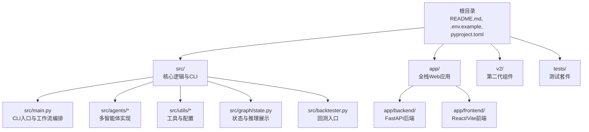
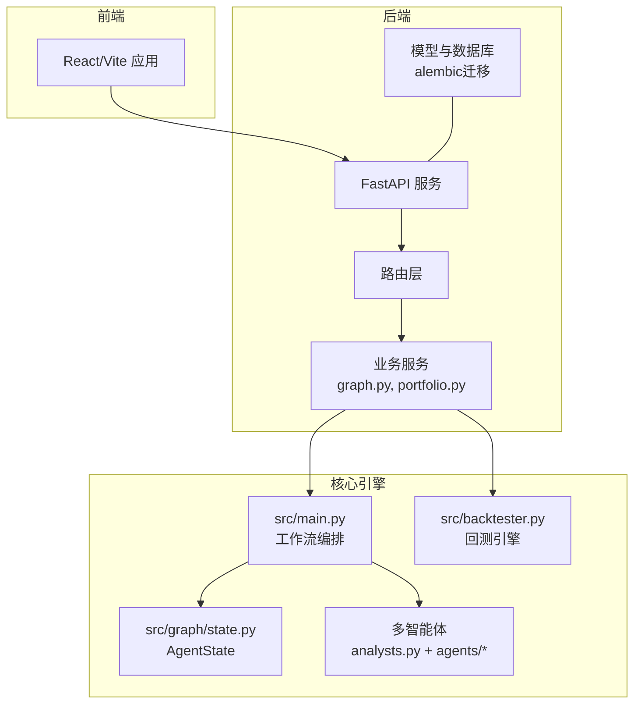
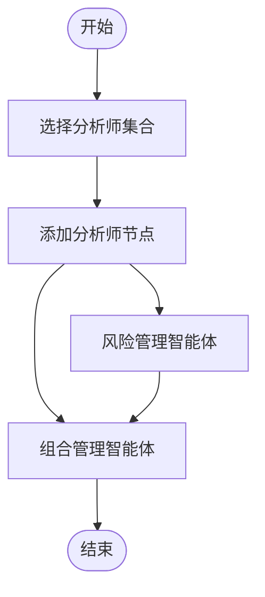
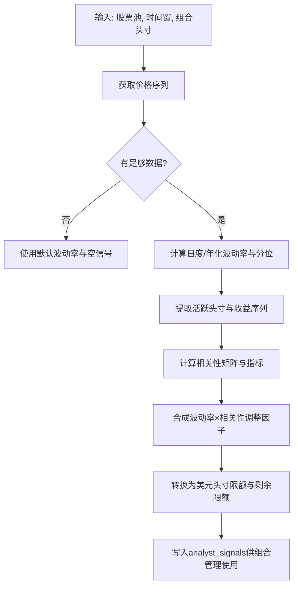
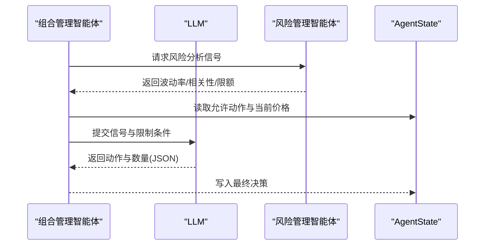
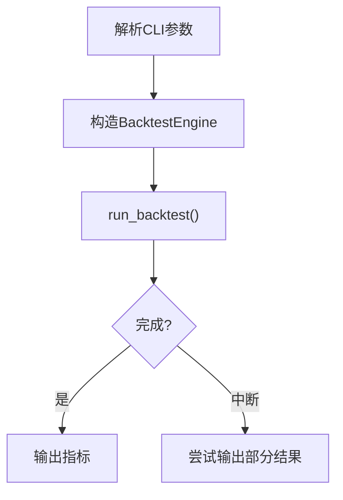
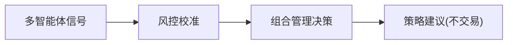
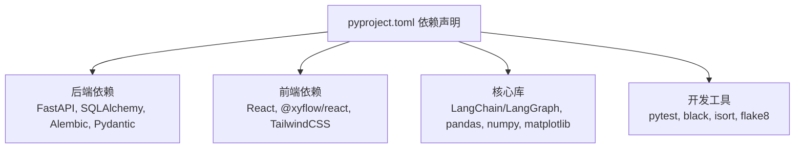

# 项目介绍

<cite>
**本文引用的文件**
- [README.md](file://README.md)
- [app/README.md](file://app/README.md)
- [src/main.py](file://src/main.py)
- [src/graph/state.py](file://src/graph/state.py)
- [src/utils/analysts.py](file://src/utils/analysts.py)
- [src/agents/portfolio_manager.py](file://src/agents/portfolio_manager.py)
- [src/agents/risk_manager.py](file://src/agents/risk_manager.py)
- [src/backtester.py](file://src/backtester.py)
- [pyproject.toml](file://pyproject.toml)
- [app/backend/README.md](file://app/backend/README.md)
- [app/frontend/README.md](file://app/frontend/README.md)
- [.env.example](file://.env.example)
</cite>

## 目录
1. [引言](#引言)
2. [项目结构](#项目结构)
3. [核心组件](#核心组件)
4. [架构总览](#架构总览)
5. [详细组件分析](#详细组件分析)
6. [依赖关系分析](#依赖关系分析)
7. [性能考量](#性能考量)
8. [故障排查指南](#故障排查指南)
9. [结论](#结论)
10. [附录](#附录)

## 引言
本项目旨在探索人工智能在交易决策中的应用，通过构建一个“多智能体AI投资决策系统”，模拟对冲基金的运作流程：由多个具备不同投资风格与分析维度的智能体协同工作，最终由组合管理智能体生成交易决策。项目明确声明不进行真实交易，仅用于教学与研究目的，强调其教育价值与风险提示。

- 教育与研究定位：项目面向希望理解AI如何参与投资决策的初学者与进阶用户，提供可运行、可观察、可扩展的实验平台。
- 创新点：采用多智能体协作与LangGraph状态图编排，结合LLM（大语言模型）与金融数据工具，形成从信号到风控再到下单的闭环。
- 不进行实际交易：系统不会执行真实买卖，所有输出均为策略建议与回测结果，避免任何财务风险。

**章节来源**
- [README.md:1-44](file://README.md#L1-L44)
- [app/README.md:1-232](file://app/README.md#L1-L232)

## 项目结构
项目采用分层与功能模块化组织方式：
- 根目录：顶层说明、安装与运行指引、环境变量模板
- src：核心算法与CLI入口，包含多智能体实现、回测引擎、状态定义与工具
- app：全栈Web应用（后端FastAPI + 前端React/Vite），提供可视化界面与REST API
- v2：第二代回测与数据管线（预留）
- tests：单元与集成测试

**图表来源**
- [src/main.py:133-180](file://src/main.py#L133-L180)
- [app/backend/README.md:74-91](file://app/backend/README.md#L74-L91)
- [app/frontend/README.md:6-8](file://app/frontend/README.md#L6-L8)

**章节来源**
- [README.md:54-158](file://README.md#L54-L158)
- [app/README.md:16-232](file://app/README.md#L16-L232)

## 核心组件
- 多智能体体系：涵盖价值、成长、技术分析、新闻情绪、宏观等多维度分析师智能体，以及风险管理和组合管理智能体。
- 状态图编排：使用LangGraph定义AgentState，串联各智能体节点，支持可选显示推理过程。
- 回测引擎：独立于实时交易的回放式仿真，支持自定义时间窗口与标的池。
- Web应用：提供可视化界面与REST API，便于非技术用户上手。

**章节来源**
- [src/utils/analysts.py:24-178](file://src/utils/analysts.py#L24-L178)
- [src/graph/state.py:14-52](file://src/graph/state.py#L14-L52)
- [src/agents/risk_manager.py:10-219](file://src/agents/risk_manager.py#L10-L219)
- [src/agents/portfolio_manager.py:24-93](file://src/agents/portfolio_manager.py#L24-L93)
- [src/backtester.py:42-67](file://src/backtester.py#L42-L67)

## 架构总览
系统采用“多智能体 + 状态图编排 + LLM + 金融数据”的整体架构。CLI与Web两种运行模式共享同一核心逻辑；后端提供REST API以支撑前端交互。

**图表来源**
- [app/backend/README.md:69-91](file://app/backend/README.md#L69-L91)
- [src/main.py:100-131](file://src/main.py#L100-L131)
- [src/graph/state.py:14-19](file://src/graph/state.py#L14-L19)
- [src/utils/analysts.py:184-187](file://src/utils/analysts.py#L184-L187)

## 详细组件分析

### 组件A：多智能体工作流与状态图
- 工作流构建：根据所选分析师动态添加节点，统一连接至风险管理与组合管理智能体。
- 状态结构：messages（消息序列）、data（输入数据与中间信号）、metadata（模型参数与推理开关）。
- 推理展示：可选打印每个智能体的JSON化推理与决策，便于教学演示。

**图表来源**
- [src/main.py:100-131](file://src/main.py#L100-L131)
- [src/graph/state.py:14-19](file://src/graph/state.py#L14-L19)

**章节来源**
- [src/main.py:100-131](file://src/main.py#L100-L131)
- [src/graph/state.py:14-52](file://src/graph/state.py#L14-L52)

### 组件B：风险管理系统（波动率与相关性调整）
- 数据获取：调用金融数据工具获取价格序列，计算日度/年化波动率与历史分位。
- 相关性分析：基于活跃头寸构建收益矩阵，计算平均与最大相关系数。
- 风险限额：将波动率与相关性综合调整为头寸限额百分比，换算为美元剩余限额，并考虑可用现金约束。

**图表来源**
- [src/agents/risk_manager.py:24-219](file://src/agents/risk_manager.py#L24-L219)

**章节来源**
- [src/agents/risk_manager.py:10-219](file://src/agents/risk_manager.py#L10-L219)

### 组件C：组合管理智能体（LLM决策）
- 输入：各分析师信号与允许动作集（由风险智能体提供），并结合当前价格与头寸约束。
- 决策：在LLM最小提示下，为每只股票选择单一动作与数量，确保不超过允许上限。
- 容错：若LLM失败或无有效交易机会，自动回退为持有策略。

**图表来源**
- [src/agents/portfolio_manager.py:24-93](file://src/agents/portfolio_manager.py#L24-L93)
- [src/agents/risk_manager.py:205-219](file://src/agents/risk_manager.py#L205-L219)

**章节来源**
- [src/agents/portfolio_manager.py:177-263](file://src/agents/portfolio_manager.py#L177-L263)

### 组件D：回测引擎
- 运行模式：CLI独立运行，支持键盘中断优雅退出，尽可能输出部分回测结果摘要。
- 参数传递：复用主工作流函数，传入初始资金、保证金要求、模型与分析师选择等。

**图表来源**
- [src/backtester.py:13-67](file://src/backtester.py#L13-L67)

**章节来源**
- [src/backtester.py:13-67](file://src/backtester.py#L13-L67)

### 概念总览
以下为概念性流程图，帮助初学者建立整体认知：多智能体并行产生信号 → 风控统一校准 → 组合管理做最终决策 → 输出策略建议（不执行交易）。

[此图为概念示意，无需图表来源]

## 依赖关系分析
- 后端依赖：FastAPI、SQLAlchemy/Alembic、Pydantic、HTTPX等，支撑REST API与数据库迁移。
- 前端依赖：React、@xyflow/react、Radix UI、TailwindCSS等，提供可视化与交互能力。
- 核心库：LangChain/LangGraph、pandas/numpy、matplotlib、rich/colorama等，支撑LLM调用、数据分析与输出美化。
- 开发工具：pytest、black、isort、flake8，保障代码质量与一致性。

**图表来源**
- [pyproject.toml:13-41](file://pyproject.toml#L13-L41)

**章节来源**
- [pyproject.toml:13-62](file://pyproject.toml#L13-L62)

## 性能考量
- 并行信号采集：风险智能体对多标的并行处理，注意API速率限制与数据完整性。
- LLM提示优化：组合管理智能体采用极简提示与预过滤允许动作，降低token消耗与提升确定性。
- 回测效率：回测按日期步进执行，建议合理设置时间范围与标的规模，避免过长运行时间。
- 可视化与调试：启用推理展示会增加IO开销，适合教学演示，生产运行可关闭。

[本节为通用指导，无需章节来源]

## 故障排查指南
- 后端uvicorn命令未找到：清理Poetry环境并重新安装依赖，确认Python版本与依赖可用。
- Python版本问题：推荐使用Python 3.11，避免与较新版本的兼容性问题。
- 环境变量缺失：确保根目录存在.env文件并正确填写API密钥。
- 权限问题（Mac/Linux）：为脚本赋予执行权限后再运行。
- 端口占用：若8000/5173被占用，可终止进程或修改脚本端口。

**章节来源**
- [app/README.md:175-232](file://app/README.md#L175-L232)

## 结论
本项目通过“多智能体 + LLM + 金融数据”的组合，构建了一个可运行、可教学、可扩展的AI投资决策系统原型。它强调教育价值与风险隔离，不进行真实交易，适合初学者理解AI在量化投资中的角色与边界。通过CLI与Web两种入口，用户可以灵活选择学习与实践路径。

[本节为总结，无需章节来源]

## 附录

### 快速理解框架（给初学者）
- 什么是多智能体：多个“专家”智能体分别从不同角度（价值、成长、技术、情绪、宏观等）给出信号。
- 风控与组合管理：风控智能体统一评估波动率与相关性，给出头寸限额；组合管理智能体在限额内做最终决策。
- 不做交易：系统只输出策略建议，不执行买卖，避免真实财务风险。
- 如何开始：先阅读根README与app/README，再运行CLI或Web应用，逐步替换API密钥与选择分析师。

**章节来源**
- [README.md:1-158](file://README.md#L1-L158)
- [app/README.md:1-232](file://app/README.md#L1-L232)

### API密钥配置参考
- 金融数据API：用于获取价格序列与财务数据
- LLM提供商：OpenAI、Anthropic、DeepSeek、Groq、Google、xAI、Moonshot、Azure OpenAI等

**章节来源**
- [.env.example:1-43](file://.env.example#L1-L43)