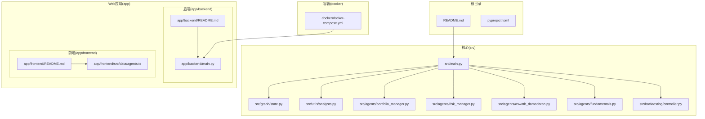
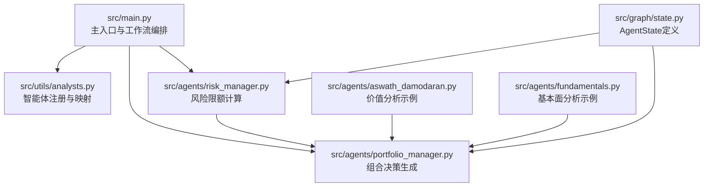
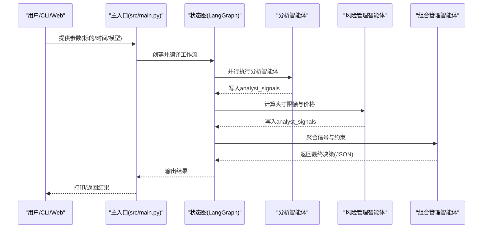
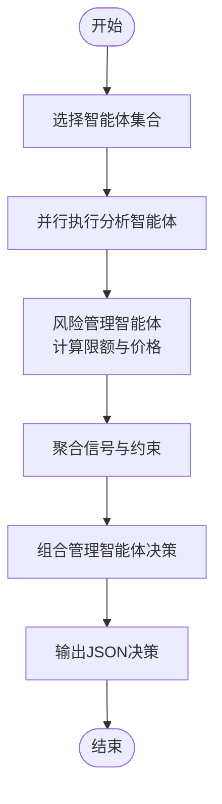
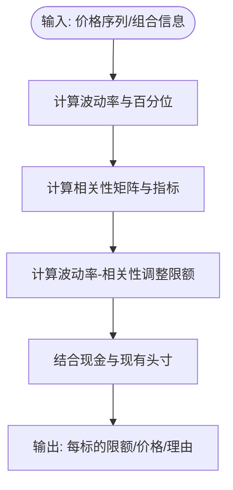
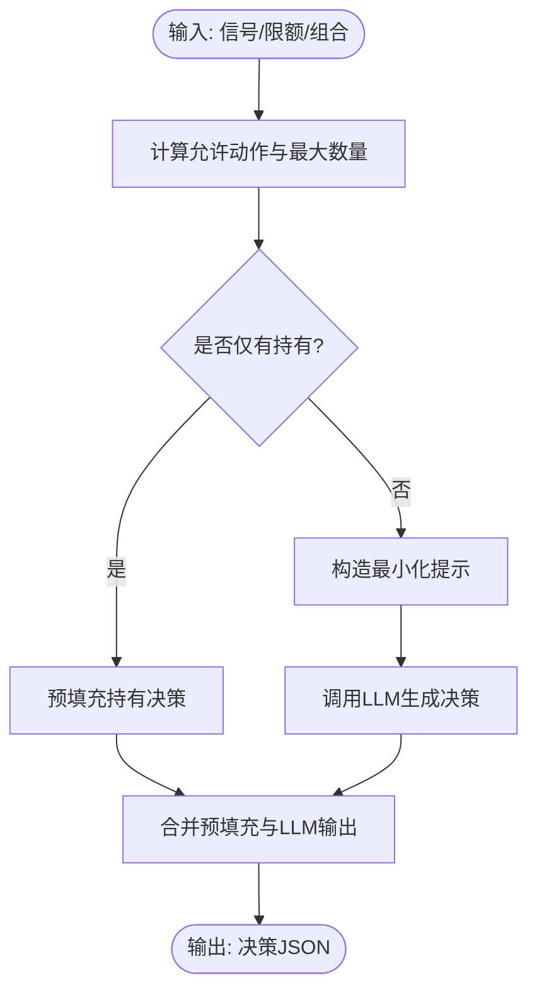
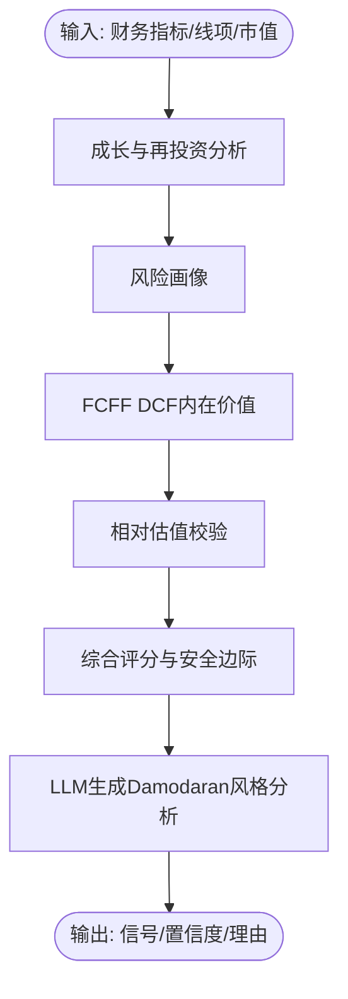
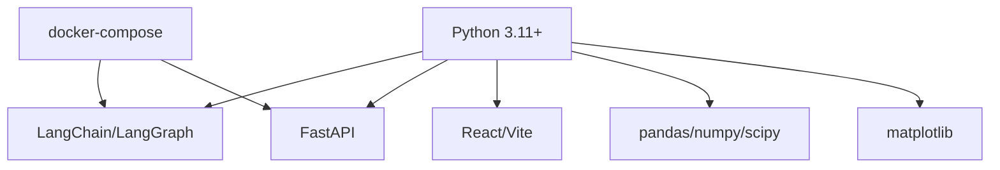

# 项目概述

<cite>
**本文引用的文件**
- [README.md](file://README.md)
- [pyproject.toml](file://pyproject.toml)
- [src/main.py](file://src/main.py)
- [src/graph/state.py](file://src/graph/state.py)
- [src/utils/analysts.py](file://src/utils/analysts.py)
- [src/agents/portfolio_manager.py](file://src/agents/portfolio_manager.py)
- [src/agents/risk_manager.py](file://src/agents/risk_manager.py)
- [src/agents/aswath_damodaran.py](file://src/agents/aswath_damodaran.py)
- [src/agents/fundamentals.py](file://src/agents/fundamentals.py)
- [src/backtesting/controller.py](file://src/backtesting/controller.py)
- [docker/docker-compose.yml](file://docker/docker-compose.yml)
- [app/backend/README.md](file://app/backend/README.md)
- [app/backend/main.py](file://app/backend/main.py)
- [app/frontend/README.md](file://app/frontend/README.md)
- [app/frontend/src/data/agents.ts](file://app/frontend/src/data/agents.ts)
</cite>

## 目录
1. [引言](#引言)
2. [项目结构](#项目结构)
3. [核心组件](#核心组件)
4. [架构总览](#架构总览)
5. [详细组件分析](#详细组件分析)
6. [依赖分析](#依赖分析)
7. [性能考虑](#性能考虑)
8. [故障排查指南](#故障排查指南)
9. [结论](#结论)
10. [附录](#附录)

## 引言
本项目是一个用于探索人工智能在交易决策中应用的教育型演示系统。它通过一组“投资大师”智能体与风险控制、组合管理等模块协同工作，形成一个多智能体的AI对冲基金决策流程。系统既支持命令行运行，也提供Web前端界面（后端与前端均处于开发中），并通过容器化部署简化环境搭建。

项目强调以下目标：
- 教育与研究：帮助学习者理解多智能体投资决策的思路与实现方式
- 可视化与可交互：通过Web界面直观展示分析过程与输出
- 可扩展性：以模块化设计支持新增智能体与分析维度
- 实战模拟：提供回测引擎，便于评估策略效果

此外，项目明确声明仅供教育用途，不提供任何投资建议或担保。

**章节来源**
- [README.md:1-158](file://README.md#L1-L158)

## 项目结构
项目采用分层与按功能域划分的组织方式：
- 根目录：顶层说明、安装与运行指引、依赖配置
- src：核心逻辑（主入口、图状态、工具、智能体、回测）
- app：全栈Web应用（后端FastAPI、前端React/Vite）
- docker：容器化编排（Ollama本地大模型服务与应用镜像）
- tests：测试用例（含集成测试与数据夹具）

**图表来源**
- [README.md:1-158](file://README.md#L1-L158)
- [pyproject.toml:1-62](file://pyproject.toml#L1-L62)
- [src/main.py:1-180](file://src/main.py#L1-L180)
- [src/graph/state.py:1-52](file://src/graph/state.py#L1-L52)
- [src/utils/analysts.py:1-201](file://src/utils/analysts.py#L1-L201)
- [src/agents/portfolio_manager.py:1-263](file://src/agents/portfolio_manager.py#L1-L263)
- [src/agents/risk_manager.py:1-318](file://src/agents/risk_manager.py#L1-L318)
- [src/agents/aswath_damodaran.py:1-420](file://src/agents/aswath_damodaran.py#L1-L420)
- [src/agents/fundamentals.py:1-164](file://src/agents/fundamentals.py#L1-L164)
- [src/backtesting/controller.py:1-68](file://src/backtesting/controller.py#L1-L68)
- [app/backend/README.md:1-102](file://app/backend/README.md#L1-L102)
- [app/backend/main.py:1-56](file://app/backend/main.py#L1-L56)
- [app/frontend/README.md:1-37](file://app/frontend/README.md#L1-L37)
- [app/frontend/src/data/agents.ts:1-31](file://app/frontend/src/data/agents.ts#L1-L31)
- [docker/docker-compose.yml:1-95](file://docker/docker-compose.yml#L1-L95)

**章节来源**
- [README.md:1-158](file://README.md#L1-L158)
- [pyproject.toml:1-62](file://pyproject.toml#L1-L62)
- [docker/docker-compose.yml:1-95](file://docker/docker-compose.yml#L1-L95)

## 核心组件
- 多智能体分析体系
  - 投资大师智能体：如Aswath Damodaran、Ben Graham、Warren Buffett等，分别代表不同的价值与成长理念
  - 专业分析智能体：基本面、技术面、新闻情绪、估值等
- 风险管理智能体：基于波动率与相关性计算头寸限额，保障组合整体风险可控
- 组合管理智能体：汇总各分析师信号与约束，生成最终交易决策（买入/卖出/做空/做多/持有）与数量
- 图执行与状态：使用LangGraph的状态图驱动多智能体协作，统一传递消息与数据
- 回测控制器：标准化代理输出，兼容历史回测流程

**章节来源**
- [src/utils/analysts.py:24-178](file://src/utils/analysts.py#L24-L178)
- [src/agents/risk_manager.py:10-318](file://src/agents/risk_manager.py#L10-L318)
- [src/agents/portfolio_manager.py:24-263](file://src/agents/portfolio_manager.py#L24-L263)
- [src/graph/state.py:14-52](file://src/graph/state.py#L14-L52)
- [src/backtesting/controller.py:9-68](file://src/backtesting/controller.py#L9-L68)

## 架构总览
系统采用“智能体+状态图”的协作模式：
- 主入口负责解析参数、构建工作流、编译状态图并执行
- 各分析智能体并行产出信号，风险智能体集中计算限额
- 组合管理智能体在满足资金与头寸约束的前提下，调用LLM生成最终决策
- Web后端提供REST接口，前端通过API获取可用智能体列表与运行结果

**图表来源**
- [src/main.py:100-130](file://src/main.py#L100-L130)
- [src/graph/state.py:14-52](file://src/graph/state.py#L14-L52)
- [src/utils/analysts.py:184-201](file://src/utils/analysts.py#L184-L201)
- [src/agents/risk_manager.py:10-318](file://src/agents/risk_manager.py#L10-L318)
- [src/agents/portfolio_manager.py:24-263](file://src/agents/portfolio_manager.py#L24-L263)
- [src/agents/aswath_damodaran.py:27-137](file://src/agents/aswath_damodaran.py#L27-L137)
- [src/agents/fundamentals.py:10-164](file://src/agents/fundamentals.py#L10-L164)

## 详细组件分析

### 多智能体AI投资决策系统工作原理
- 工作流编排
  - 主入口根据用户选择构建状态图，添加起始节点与所选分析智能体节点，并连接至风险与组合管理节点
  - 编译后的图实例接收输入状态（消息、数据、元数据），依次执行各节点
- 信息传递
  - 每个智能体将分析结果写入状态中的“analyst_signals”，组合管理阶段读取并融合
  - 状态图统一维护消息序列与数据字典，确保跨节点一致性
- 决策生成
  - 风险管理智能体计算每只股票的剩余头寸限额与当前价格
  - 组合管理智能体在已知信号与约束条件下，调用LLM生成最终动作与数量，并返回JSON格式结果

**图表来源**
- [src/main.py:100-130](file://src/main.py#L100-L130)
- [src/graph/state.py:14-52](file://src/graph/state.py#L14-L52)
- [src/agents/risk_manager.py:10-318](file://src/agents/risk_manager.py#L10-L318)
- [src/agents/portfolio_manager.py:24-263](file://src/agents/portfolio_manager.py#L24-L263)

**章节来源**
- [src/main.py:45-130](file://src/main.py#L45-L130)
- [src/graph/state.py:14-52](file://src/graph/state.py#L14-L52)

### 投资大师智能体协作机制
- 智能体注册与选择
  - 通过统一配置表注册所有智能体，支持按需启用
  - 默认情况下启用全部分析智能体，也可由用户指定
- 信号聚合与融合
  - 风险管理智能体先期提供价格与限额，组合管理智能体再进行信号压缩与约束下决策
  - 不同智能体代表不同投资哲学，最终决策由LLM在约束空间内综合权衡

**图表来源**
- [src/utils/analysts.py:184-201](file://src/utils/analysts.py#L184-L201)
- [src/agents/risk_manager.py:10-318](file://src/agents/risk_manager.py#L10-L318)
- [src/agents/portfolio_manager.py:24-263](file://src/agents/portfolio_manager.py#L24-L263)

**章节来源**
- [src/utils/analysts.py:24-178](file://src/utils/analysts.py#L24-L178)

### 风险管理智能体
- 功能要点
  - 获取价格序列，计算波动率与相关性指标
  - 基于波动率与相关性调整头寸上限，结合现有持仓与现金计算剩余可用额度
  - 将分析结果写入状态，供组合管理阶段使用
- 关键算法
  - 波动率计算：滚动窗口标准差与年化转换
  - 相关性调整：基于活跃头寸的平均/最大相关系数
  - 限额计算：基础比例随波动率与相关性动态调整

**图表来源**
- [src/agents/risk_manager.py:222-318](file://src/agents/risk_manager.py#L222-L318)

**章节来源**
- [src/agents/risk_manager.py:10-318](file://src/agents/risk_manager.py#L10-L318)

### 组合管理智能体
- 功能要点
  - 在已知信号与约束条件下，生成最终交易决策
  - 对无法交易的情况预填充“持有”决策，减少LLM负担
  - 使用最小化提示模板，仅传递必要上下文，提升稳定性与效率
- 输出规范
  - JSON结构包含每个标的的动作、数量、置信度与简要理由

**图表来源**
- [src/agents/portfolio_manager.py:96-263](file://src/agents/portfolio_manager.py#L96-L263)

**章节来源**
- [src/agents/portfolio_manager.py:24-263](file://src/agents/portfolio_manager.py#L24-L263)

### 示例：Aswath Damodaran智能体
- 分析维度
  - 成长与再投资效率、风险画像、DCF内在价值、相对估值交叉验证
  - 基于CAPM估算权益成本，结合安全边际给出买卖信号
- 输出
  - 信号（看涨/看跌/中性）、置信度与可解释的理由

**图表来源**
- [src/agents/aswath_damodaran.py:27-137](file://src/agents/aswath_damodaran.py#L27-L137)

**章节来源**
- [src/agents/aswath_damodaran.py:27-420](file://src/agents/aswath_damodaran.py#L27-L420)

### 示例：基本面分析智能体
- 分析维度
  - 盈利能力（ROE/净利率/运营利润率）、增长趋势（营收/利润/账面价值）、财务健康（流动比率/负债率/自由现金流）、估值比率（P/E/PB/PS）
- 输出
  - 综合信号与置信度，以及各子维度的细节说明

**章节来源**
- [src/agents/fundamentals.py:10-164](file://src/agents/fundamentals.py#L10-L164)

### 回测控制器
- 职责
  - 规范化代理输出，确保动作与数量类型一致，避免None/缺失键导致的异常
  - 保留代理提供的分析师信号，便于后续分析与可视化

**章节来源**
- [src/backtesting/controller.py:9-68](file://src/backtesting/controller.py#L9-L68)

## 依赖分析
- 语言与框架
  - Python 3.11+，使用Poetry管理依赖
  - LangChain/LangGraph用于智能体与状态图
  - FastAPI作为后端框架，提供REST接口
  - React/Vite作为前端框架
- 数据与可视化
  - pandas/numpy/scipy用于数值与统计分析
  - matplotlib用于图表输出
- 容器化
  - docker-compose编排Ollama本地大模型服务与应用服务

**图表来源**
- [pyproject.toml:13-41](file://pyproject.toml#L13-L41)
- [docker/docker-compose.yml:1-95](file://docker/docker-compose.yml#L1-L95)

**章节来源**
- [pyproject.toml:1-62](file://pyproject.toml#L1-L62)
- [docker/docker-compose.yml:1-95](file://docker/docker-compose.yml#L1-L95)

## 性能考虑
- 并行化与最小化提示
  - 分析智能体并行执行，降低总体延迟
  - 组合管理阶段仅传递必要上下文，减少Token消耗与推理开销
- 数据复用与缓存
  - 风险智能体计算的价格与波动率结果可被后续步骤直接使用，避免重复API调用
- 回测与批处理
  - 回测控制器规范化输出，便于批量处理与结果对比

[本节为通用指导，无需特定文件引用]

## 故障排查指南
- 环境变量与API密钥
  - 确保根目录存在.env文件并正确设置至少一种大模型API密钥与金融数据API密钥
- 本地大模型（Ollama）
  - 若使用本地模型，请确认Ollama服务已安装并运行，或通过docker-compose启动
- 后端服务
  - 后端启动时会检查Ollama状态；若未安装或未运行，可在设置页面或手动启动
- 前端联调
  - 前端默认从后端拉取智能体列表；若无法加载，请检查后端路由与CORS配置

**章节来源**
- [README.md:65-82](file://README.md#L65-L82)
- [app/backend/main.py:32-56](file://app/backend/main.py#L32-L56)
- [app/frontend/src/data/agents.ts:14-31](file://app/frontend/src/data/agents.ts#L14-L31)

## 结论
本项目以多智能体为核心，结合风险控制与组合管理，构建了一个可交互、可扩展且具备教育价值的AI对冲基金决策框架。通过模块化的智能体设计与状态图编排，系统能够灵活地融合多种投资理念与分析方法，并在约束条件下生成稳健的交易决策。配合Web界面与回测引擎，用户可以直观地观察分析过程与策略表现，适合教学、研究与原型验证。

[本节为总结性内容，无需特定文件引用]

## 附录
- 快速开始
  - 命令行：安装依赖后，直接运行主程序并传入标的与日期范围
  - Web应用：参考后端与前端README，分别启动后端与前端
- 容器化运行
  - 使用docker-compose一键启动Ollama与应用服务，支持多种运行模式（普通/显示推理/本地模型/回测）

**章节来源**
- [README.md:84-137](file://README.md#L84-L137)
- [app/backend/README.md:12-68](file://app/backend/README.md#L12-L68)
- [app/frontend/README.md:10-27](file://app/frontend/README.md#L10-L27)
- [docker/docker-compose.yml:18-91](file://docker/docker-compose.yml#L18-L91)